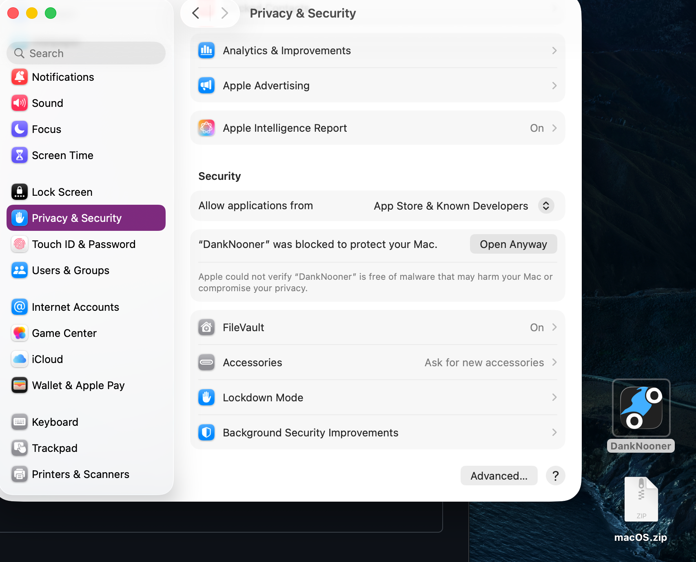

# Dank Nooner

**A physics-based motorcycle stunt game. Wheelies, wrecks, and questionable decisions.**

An open-world motorcycle game about doing every stupid thing you'd never try in real life. Realistic controls meet arcade-style tricks — progressive braking, limited grip, and ragdoll crashes. Weave through traffic doing wheelies, pull skate-style tricks off ramps, race friends online, and progress from a bicycle to a fully customized sport bike.

> **Play the v1 POC:** [Itch.io](https://theofficialssebs.itch.io/dank-nooner)

Check the latest dev build! Download the **.zip** for your platform [here](https://github.com/ssebs/DankNooner/releases)

Note for Mac users:

You will need to allow the app explicitly.
- Double click to extract the .zip
- Double click to run **DankNooner.app**
- Open **System Settings** > **Privacy & Security** > Scroll down to **Security**
- You should see `"DankNooner" was blocked to protect your Mac.`, click the **Open Anyway** button to the right

## Highlights

- **Tricks & combos** — Wheelies, stoppies, backflips, drifts, burnouts, and ramp tricks with a combo chain system
- **Multiplayer** — Ride with friends or drop into open lobbies
- **Game modes** — Free roam, street races, stunt races, track races, S.K.A.T.E.-style trick challenges, and traffic weaving
- **Open world** — Island map with city, suburbs, mountain roads, race track, dirt jumps, and a megaramp
- **Progression** — Start on a bicycle, unlock bikes up to sport bikes, earn cash for upgrades and customization
- **Singleplayer** — Story mode planned for full release

## Roadmap

| Phase              | Status      | Description                                                                                      |
| ------------------ | ----------- | ------------------------------------------------------------------------------------------------ |
| **V1 — POC**       | Complete    | Wheelie balance game on [Itch.io](https://theofficialssebs.itch.io/dank-nooner) + full player controller POC ([download v1.0](https://github.com/ssebs/moto-player-controller-godot/releases/tag/v1.0)) |
| **V2 — MVP**       | In Progress | Multiplayer open-world rewrite with expanded tricks, racing, and progression                     |
| **V3 — Full Game** | Planned     | Story mode, quests, cutscenes, full trick system, polish                                         |

## Source Code

| Version | Directory       |
| ------- | --------------- |
| V1      | [v1/](./v1/)   |
| V2      | [v2/](./v2/)   |

## Related Projects

POC repos that fed into V2:

- [multiplayer-poc-godot](https://github.com/ssebs/multiplayer-poc-godot) — Lobby and player sync prototype
- [inverse-kinematics-poc](https://github.com/ssebs/inverse-kinematics-poc) — IK rider animations
- [moto-player-controller-godot](https://github.com/ssebs/moto-player-controller-godot) — Player controls, physics, tricks, and ragdoll

## Planning Docs

See [v2/planning_docs/](./v2/planning_docs/) for detailed design and project status:

- [TODO](./v2/planning_docs/TODO.md)
- [Milestones](./v2/planning_docs/Milestones.md)
- [Goals & Requirements](./v2/planning_docs/GoalsRequirements.md)
- [Architecture / Design](./v2/planning_docs/Architecture.md)
- [Marketing](./v2/planning_docs/Marketing.md)
- [Story / Singleplayer](./v2/planning_docs/StorySingleplayer.md)

## Media

#### Gameplay Demo from `moto-player-controller`:

#### Multiplayer Demo from `multiplayer-poc-godot`:

## License

[AGPL](./LICENSE)
