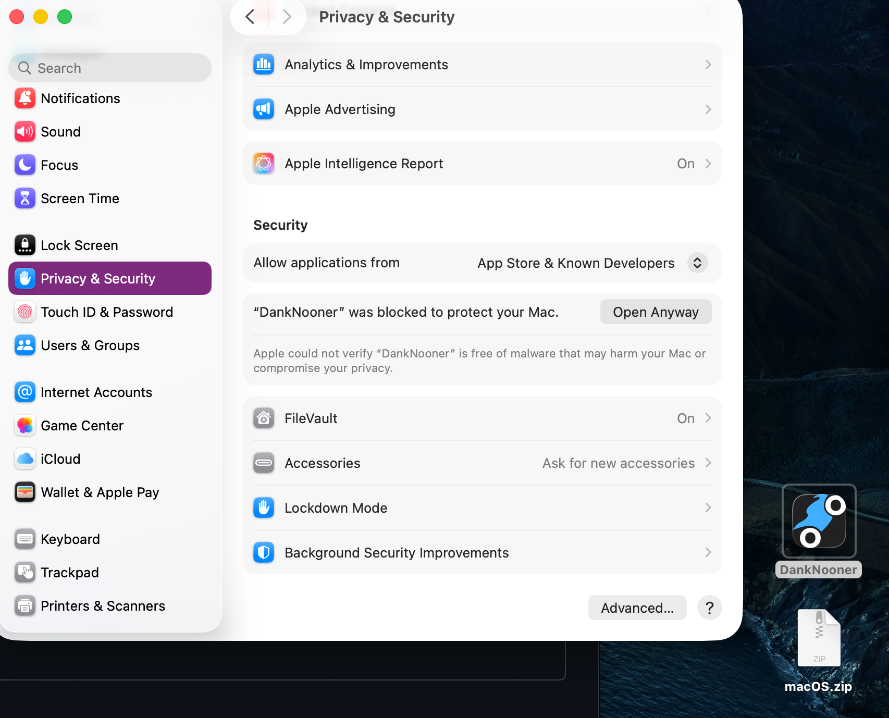

 

**An open-world motorcycle game about doing every stupid thing you'd never try in real life.**

Realistic controls meet arcade tricks: progressive braking, balance point wheelies, ragdoll crashes, and more. Weave through traffic doing 12'oclock wheelies, do FMX tricks off ramps, race friends online, and upgrade your bikes to show them off.

## Play

> Best played with a controller! But Keyboard + Mouse works too

- **Browser (no sound yet):** [ssebs.github.io/DankNooner](https://ssebs.github.io/DankNooner/)
- **Desktop builds (Win/Mac/Linux):** [latest release](https://github.com/ssebs/DankNooner/releases)
- **V1 POC (wheelie balance):** [itch.io](https://theofficialssebs.itch.io/dank-nooner-poc)

Note for Mac users

You will need to allow the app explicitly.

- Double click to extract the .zip
- Double click to run **DankNooner.app**
- Open **System Settings** > **Privacy & Security** > Scroll down to **Security**
- You should see `"DankNooner" was blocked to protect your Mac.`, click the **Open Anyway** button to the right

## V2 Status

V2 is the multiplayer open-world rewrite, in active development. The browser build and desktop releases above are all V2. For live progress see [planning_docs/TODO.md](./v2/planning_docs/TODO.md).

What works today:

- Free roam multiplayer over WebRTC (NAT punch via a signaling server, no port forwarding)
- Server-authoritative physics with client prediction and rollback (netfox)
- Wheelies, stoppies, backflips, frontflips, 360s, heel clickers, high chairs
- Crash detection and ragdoll
- Manual gearbox with clutch, RPM, and progressive braking
- IK rider animation that adapts per bike (hand and foot markers per `BikeSkinDefinition`)
- FMOD engine audio that blends with RPM
- Basic tutorial gamemode and start-circle gamemode triggers
- Bike and character skin customization with color slots and mods

What's next (see [GameplayAndModes.md](./v2/planning_docs/GameplayAndModes.md) for the full design):

- Street race, trick battle, and crash-launch gamemodes
- Traffic AI and near-miss tricks
- Customization shop, progression, and saved player stats
- Larger island map
- Story mode (V3)

<!-- TODO: short clip or screenshot of multiplayer free roam -->

## From V1 to V2

V1 was a single-mechanic POC: hold a wheelie as long as you can without flipping. It validated that the balance-point feel was fun on its own ([play it on itch](https://theofficialssebs.itch.io/dank-nooner-poc)). V2 keeps that core feel and builds an open world, multiplayer, and a full trick system around it.

| Phase | Status      | Notes                                                                                                                                        |
| ----- | ----------- | -------------------------------------------------------------------------------------------------------------------------------------------- |
| V1    | Complete    | Wheelie balance POC on itch + standalone player controller ([v1.0](https://github.com/ssebs/moto-player-controller-godot/releases/tag/v1.0)) |
| V2    | In progress | Multiplayer open-world rewrite. Track work in [TODO.md](./v2/planning_docs/TODO.md)                                                          |
| V3    | Planned     | Story mode, quests, full polish                                                                                                              |

Source for each version lives in [v1/](./v1/) and [v2/](./v2/).

POC repos that fed into V2

- [multiplayer-poc-godot](https://github.com/ssebs/multiplayer-poc-godot) - lobby and player sync
- [inverse-kinematics-poc](https://github.com/ssebs/inverse-kinematics-poc) - IK rider animations
- [moto-player-controller-godot](https://github.com/ssebs/moto-player-controller-godot) - controls, physics, tricks, ragdoll
- [danknoonersignalserver](https://github.com/ssebs/danknoonersignalserver/) - WebRTC signaling for NAT traversal (`docker pull ssebs/danknoonersignalserver:latest`)

## Planning Docs

Design notes and current status live in [v2/planning_docs/](./v2/planning_docs/):

- [TODO](./v2/planning_docs/TODO.md) - active work and backlog
- [Architecture](./v2/planning_docs/Architecture.md)
- [GameplayAndModes](./v2/planning_docs/GameplayAndModes.md)
- [PlayerController](./v2/planning_docs/PlayerController.md)
- [Skins](./v2/planning_docs/Skins.md)
- [Goals & Requirements](./v2/planning_docs/GoalsRequirements.md)
- [Story / Singleplayer](./v2/planning_docs/StorySingleplayer.md)
- [Marketing](./v2/planning_docs/Marketing.md)

## Media

V1 player controller demo:

V1 multiplayer POC:

<!-- TODO: replace/extend with V2 media once something is stable enough to not rot -->

## License

[AGPL](./LICENSE)
