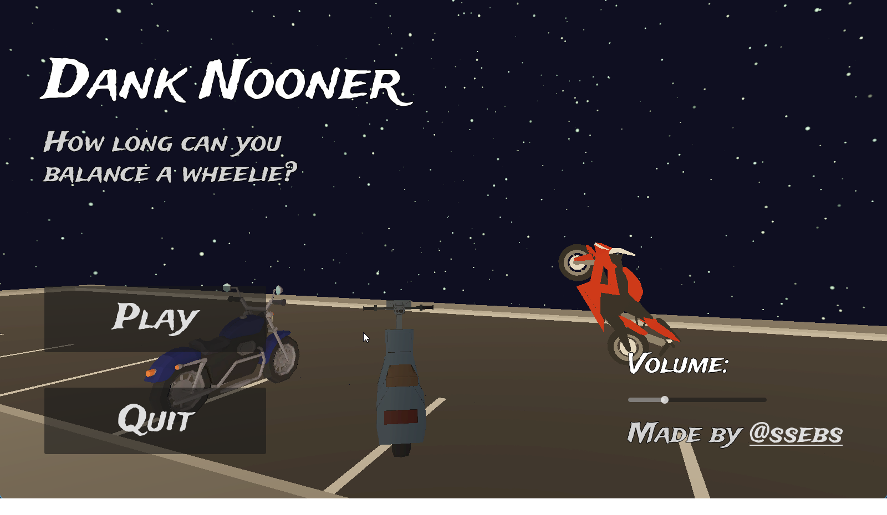

# Dank Nooner

Wheelie challenge game, try to hold a wheelie for as long as you can & earn points to upgrade your bike.

[theofficialssebs.itch.io/dank-nooner](https://theofficialssebs.itch.io/dank-nooner)

TODO:
- add quit btn on restart screen + make new screen for that
- Make speed feel faster / better / increase

Gameplay:
- [x] mouse => throttle / lean control
  - [ ] also support keyboard press
- [x] score based on speed * angle
- [x] restart game loop
- [x] treadmill road using motorcycle's speed
- [x] cars spawn w/ collision
- [x] rpm dependent sound
- [x] add randomness to balance
- [x] avoid traffic on highway by switching lanes
- [x] other hazards (speed bump, gravel, oil slick, etc.)
- [x] gas can run out
- [ ] add gears

Misc:
- [ ] sfx at 1mi (dank nooner brah, siiiick, etc.)
- [x] main menu
- [x] working volume
- [ ] android support

Upgrades:
- [ ] Increase fuel
- [ ] Increase speed
- [ ] Armour (allow 1-3 hits)
- [ ] Unlock the pickups?
- [ ] Pickups spawn rate?
- [ ] Other tricks (360, flip)?

Pickups:
- [ ] Gas
- [ ] Speed boost

Bugs:
- [ ] Web export [see](https://forum.godotengine.org/t/mouse-jumps-on-exported-web-build/57385)

Out of scope:
- avoid cops?
- shoot at cars?
