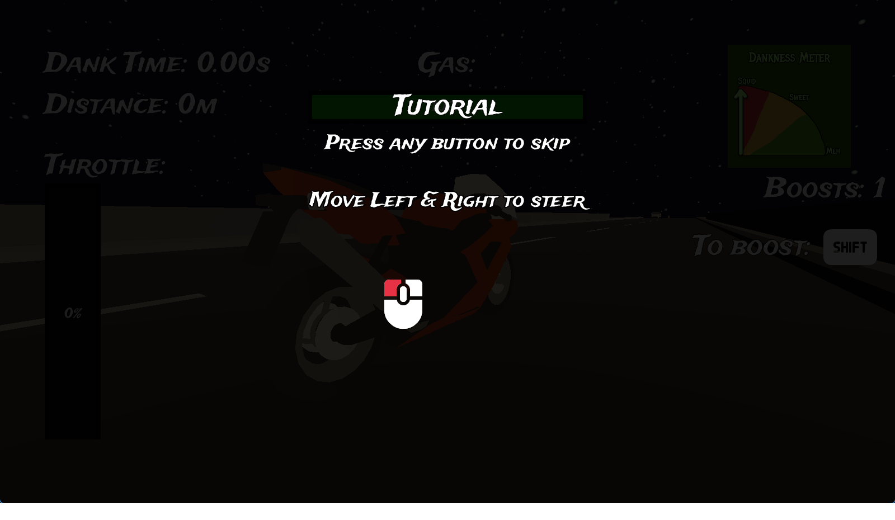

# Dank Nooner

Wheelie challenge game, try to hold a wheelie for as long as you can & earn points to upgrade your bike.

[theofficialssebs.itch.io/dank-nooner](https://theofficialssebs.itch.io/dank-nooner)

- Multiple upgrade cost by upgrade level, not just fuel

## Minor Refactor:
- Organize UI vars
- Input:
  - Move window capture to `main_game`
  - Disable input as a global
- Money doesn't update when spending it

## Scope Creep:
- Add different levels to unlock
  - Maybe like RV there yet with 1 long map with diff zones w/ checkpoints?
- Story / goal is to "Make it home alive"

## TODO:
- Fix steering w/ mouse (goes right on web)
- Make speed feel faster / better / increase
  - Speed boost FX (leave flame trail)
- Fix pickups 
  - not working
  - icon/hitbox size
- Fix hazard hitbox size
- Rider on bike can ragdoll on crash
  - uses IK to animate to hold on to bike / lean

## Gameplay:
- [x] mouse => throttle / lean control
  - [x] also support keyboard press
- [x] score based on speed * angle
- [x] restart game loop
- [x] treadmill road using motorcycle's speed
- [x] cars spawn w/ collision
- [x] rpm dependent sound
- [x] add randomness to balance
- [x] avoid traffic on highway by switching lanes
- [x] other hazards (speed bump, gravel, oil slick, etc.)
- [x] gas can run out
- [ ] Dank time should reward / give currency for unlocking tricks
- [ ] add pickups
- [ ] add gears
- [ ] more road types (turns/intersections/freeway vs street.)
- [ ] Global Leaderboard

## Misc:
- [ ] FX at 1mi (dank nooner brah, siiiick, skybox change, etc.)
- [x] main menu
- [x] working volume
- [x] android support

## Upgrades:
- [x] Increase speed boost count
- [x] Increase fuel
- [x] Increase max speed
- [ ] Use up $
- [ ] Armour (allow 1-3 hits)
- [ ] Tricks (360, flip)?

## Pickups:
- [ ] Gas
- [ ] Speed boost

## Bugs:
- [ ] Web export [see](https://forum.godotengine.org/t/mouse-jumps-on-exported-web-build/57385)
- [ ] Force road items to despawn on new run
  - [ ] also don't spawn items in player

## Out of scope:
- avoid cops?
- shoot at cars?
