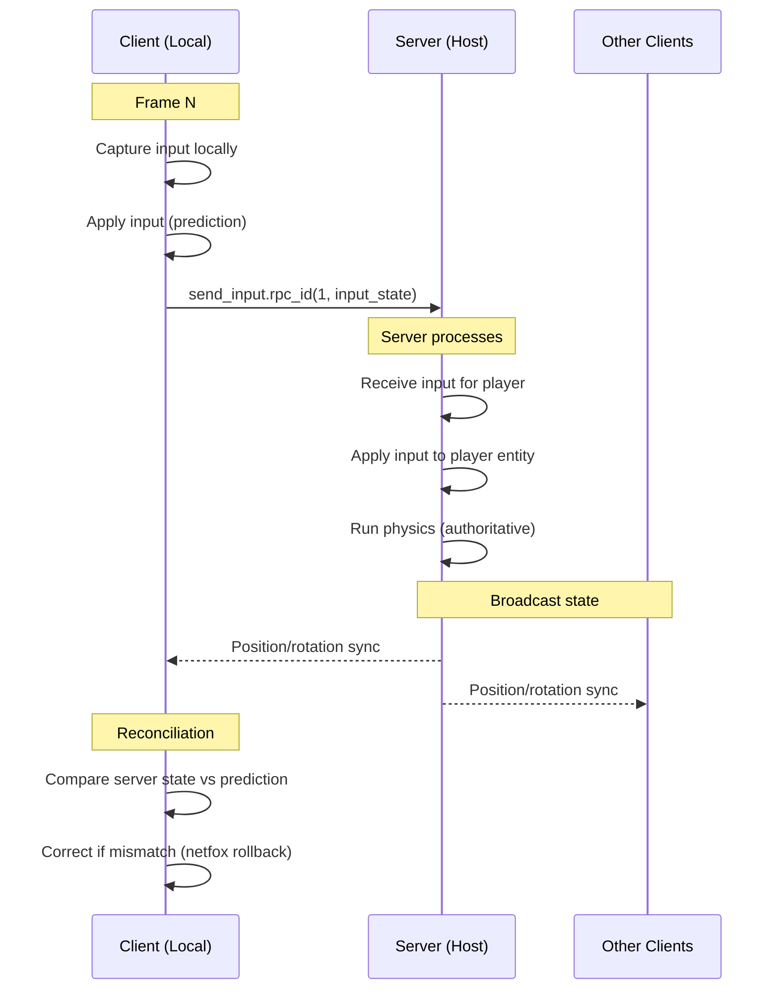
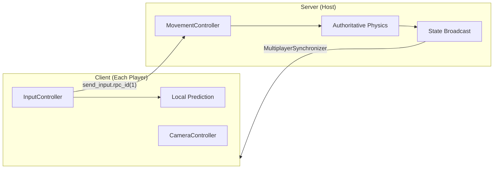

# Architecture / Design

> How the game works under the hood

## High Level

### Tips for me:

- [ ] Think about how to use composition in game, like x has a y. Think golang struct has a struct. I.e. dog has age/walk anim/collider handler/etc components. When something spawns in, it has a popanim component that plays,
- [ ] I don't have to write code the godot way, e.g. load/save my own files without nodes. Use until funcs
- [ ] hand write the code & plan structure. Don't import moto-poc, but re-create it using better systems
- Use spatial comments (debug notes in the level itself)

#### Debug levels

- See @level_manager's Console cmd
  - \` then `dbg_gym` to load that test level right from the main menu

### Stuff to plan out:

- Filesystem / folder structure
- Gameplay Loop w/ Flowcharts
- Code Structure
  - Signal Buses
- different systems that are needed
- How different systems work together
- Save system (use my own json instead of following godot's recursive way like G&L)
- NPC AI (traffic)
- multiplayer
- MORE

### Features to plan out:

- Tutorials via challenges
  - Teach how to shift, do tricks, and physics of braking via examples.
  - Speed up to 60 then take this corner at the apex, brake progressively

## Nitty-Gritty

### Godot groups

- `utils/constants.gd` has a map of Group name to group name. This should be used whenever accessing a group name so we're sure it exists.

### Translation / Localization

- Source for strings is `localization/localization.csv`
  - This CSV is auto-imported to .translation files
- Using in UI:
  - Use the key_name from the csv, it should auto-swap.
- Using in code:
  - `print(tr("<key_name>"))`

### Editor Validation

- Click "Run Validation" on the `MainGame` node inspector to check for common wiring bugs
- Validates: null `@export` objects, missing `@onready %UniqueNode` references, `@onready` Buttons without `_on_<name>_pressed()` handlers, LevelManager enum/dict sync
- Comment out `@onready` declarations to skip validation on WIP features
- See `utils/validation/auto_validator.gd` for implementation

### Managers

- Managers extend `BaseManager` and are in the "**Managers**" group. _See constants.gd_
- How to use:
  - Create Node under `ManagerManager` Node, rename to class name of the manager. e.g. `MenuManager` node uses `menu_manager.gd` which is `MenuManager` `class_name`

### State Machine

- Managers can have a State Machine, this will transition between different states
  - e.g. MenuManager can be in MainMenuState, or SettingsMenuState, etc.
- How to use:
  - Create Node, attach StateMachine script
  - Children of this Node that are States will automatically be registered
  - Transitioning of states happens via State.transitioned() signal, or request_state_change() func
  - New States can be registered / deregistered to be managed by the state machine
  - States can receive data via `StateContext` - a base class for passing typed data between states
    - Create a subclass with properties and static factory methods (see `lobby_state_context.gd`)
    - Pass context when emitting: `transitioned.emit(target_state, MyContext.NewSomething(...))`
    - Receive in `Enter(state_context: StateContext)` and cast to your type
  - States get a `state_machine_ref` property set on registration

#### Menu State Machine System

Menus use the state machine pattern where each screen is a `MenuState` extending `State`.

##### Creating a New Menu State

> Follow other files for example.

- Create new scene > `MenuState` type
  - Name it `<TYPE>MenuState`, save to `menus/...` as `<type>_menu_state.tscn`
- Create script with `<type>_menu_state.gd` as the name
  - Give it the `class_name` `<TYPE>MenuState` extends `MenuState`
- Add a `Control` node, name it `%UI`

- `@export var menu_manager: MenuManager` + target states. (see other files)
  - In `Enter()`: call `ui.show()`, connect button signals
  - In `Exit()`: call `ui.hide()`, disconnect button signals
  - Transition via `transitioned.emit(target_state)` or `transitioned.emit(target_state, context)`
- Add this new scene in the state machine
  - Add as a child of the StateMachine node
  - Wire up the exports in inspector (menu_manager, navigation targets)

#### Key Rules

- All MenuStates **must** have a `%UI` Control node (unique name)
- Set `initial_state` on StateMachine to define the default menu
- Connect signals in `Enter()`, disconnect in `Exit()` to avoid duplicate connections

### Level Manager

Levels are managed via `LevelManager` and selected through the `LobbyMenuState` MenuState. Levels are PackedScenes that are loaded & configured in `level_manager.gd`

#### Components

- **LevelManager** (`managers/level_manager.gd`)
  - `LevelName` enum - defines all available levels
  - `possible_levels` - Dictionary mapping `LevelName` → preloaded `PackedScene`
  - `level_name_map` - Dictionary mapping `LevelName` → localization key string
  - `@export spawn_node` - Node3D where levels are instantiated

> Note - Level enum idx 0 is `LEVEL_SELECT_LABEL` (not a real level, used for dropdown default)

- **LobbyMenuState** (`menus/out_of_game/lobby_menu/`) - Level selection UI
  - `LevelSelectBtn` (OptionButton) - Dropdown for level selection
  - `StartBtn` - Triggers level spawn

#### Adding a New Level

1. Create level scene extending `LevelDefinition` (no need to wire `level_manager` export - it's set automatically on spawn)
2. Add entry to `LevelName` enum in `level_manager.gd`
3. Add entry to `level_name_map` (enum → localization key)
4. Add entry to `possible_levels` (enum → `preload("res://path/to/level.tscn")`)

### Input System <<< THIS IS OUT OF DATE >>>

The `InputStateManager` (`managers/input_state_manager.gd`) is a centralized input handler that routes input based on the current game context.

#### Input States

```gdscript
enum InputState {
    IN_MENU,           # Player is in a menu, ESC navigates menus
    IN_GAME,           # Player is playing, ESC triggers pause
    IN_GAME_PAUSED,    # Game is paused, ESC resumes game
    DISABLED,          # All input is disabled
}
```

#### Input Routing

The InputManager uses `_unhandled_input()` to process events based on `current_input_state`:

- **IN_GAME**: "pause" action → emits `pause_requested` signal
- **IN_GAME_PAUSED**: "pause" action → emits `unpause_requested` signal
- **IN_MENU**: "ui_cancel" action → delegates to current MenuState's `on_cancel_key_pressed()`
- **DISABLED**: Ignores all input

#### Mouse Cursor Control

Mouse visibility is managed based on input state:

- **IN_MENU** or **IN_GAME_PAUSED**: Mouse visible (`MOUSE_MODE_VISIBLE`)
- **IN_GAME** or **DISABLED**: Mouse captured (`MOUSE_MODE_CAPTURED`)

#### Signals

- `input_state_changed(new_state: InputState)` - Fired when state changes
- `pause_requested` - Fired when player wants to pause (IN_GAME + pause action)
- `unpause_requested` - Fired when player wants to resume (IN_GAME_PAUSED + pause action)

### Player Entity

`PlayerEntity` is a `CharacterBody3D` using composition with `@export` component references:

- `CameraController` - camera follow/control
- `MovementController` - handles movement with manual inertia
- `BikeDefinition` - resource with mesh/collision data
- `MeshComponent` - renders the bike mesh

#### MovementController

Uses `CharacterBody3D` with manual inertia simulation instead of physics forces:

- `current_speed` and `angular_velocity` are lerped for smooth acceleration/deceleration
- `apply_engine_braking()` - passive slowdown when no input
- Tunable exports: `acceleration`, `brake_decel`, `engine_brake_decel`, `turn_speed`, `turn_friction`

#### How to create skin color changing material

- Import model to godot, make sure to export textures
- Replace color in albedo/diffuse texture with #FF00FF
  - Select > Color Range
  - Edit > Fill (w/ pink)
- Save to disk
- Open skin_color.tres, save as new material
- Update the textures for the material for that mesh
- Create inherited scene from the .glb, save to characters/scenes
- Attach SkinColor script to the root node
- Update values
- Save
- Use this in character_skin.tscn

### Pause System

User stories:

- In SP or MP, hitting **PAUSE** should:
  - Open the pause menu
  - Show the Mouse / allow gamepad to control menus
  - Allow you to change settings
  - Allow you to go to the main menu
  - Customize your character (progression depends on mode)
- In Singleplayer, hitting **PAUSE** should:
  - Freeze the gameplay & pause whole world
  - Allow you to save game
  - Allow you to load game
- In Multiplayer, hitting **PAUSE** should:
  - Freeze your character? Turn half-invisible w/o hitbox
  - Allow you to invite friends to server
  - Allow you to change servers

#### Input & Pause Interaction

The `PauseManager` (`managers/pause_manager.gd`) coordinates InputManager, MenuManager, and LevelManager:

- **Pause** (`pause_requested`): Sets state to `IN_GAME_PAUSED`, shows pause menu, enables MenuManager processing, disables LevelManager processing
- **Unpause** (`unpause_requested`): Sets state to `IN_GAME`, hides menus, disables MenuManager processing, enables LevelManager processing

The same "pause" action triggers different behavior based on `InputState`.

### Unlocks / progression

#### WIP NOTES

- Singleplayer unlocks mods / cosmetics (aka 100% skin), and that unlocks skins for SP and MP
- Bikes unlock per SP/MP

- Playing SP unlocks bikes for MP?
- Playing MP unlocks skins for SP, but not bikes

### Customizing

- Have an in-world garage like LS Customs
- Pause menu btn teleports you to the garage

## Multiplayer Networking Architecture

### Authority Model: Client-Predicted, Server-Authoritative



### What Runs Where



### Authority Summary

| Component                    | Runs On               | Authority                     |
| ---------------------------- | --------------------- | ----------------------------- |
| `InputController` (capture)  | Local client only     | Client                        |
| `InputController` (send RPC) | Local client → Server | Client sends, Server receives |
| `MovementController`         | Server only           | Server                        |
| `CameraController`           | Local client only     | Client                        |
| Position/Rotation            | Server broadcasts     | Server                        |
| Lobby state                  | Server broadcasts     | Server                        |

### RPC Signatures

**InputController** - Client → Server:

```gdscript
## Sent every physics frame from client to server
## Server applies this to the correct player's MovementController
@rpc("any_peer", "unreliable_ordered")
func receive_input(input_state: Dictionary):
    # input_state = {
    #   "tick": int,           # For netfox rollback
    #   "throttle": float,     # 0.0 - 1.0
    #   "front_brake": float,  # 0.0 - 1.0
    #   "steer": float,        # -1.0 to 1.0
    #   "lean": float,         # -1.0 to 1.0
    # }
    pass
```

**Why Dictionary?** Netfox needs tick numbers for rollback. Dictionary is extensible for future inputs (rear brake, tricks, etc).
