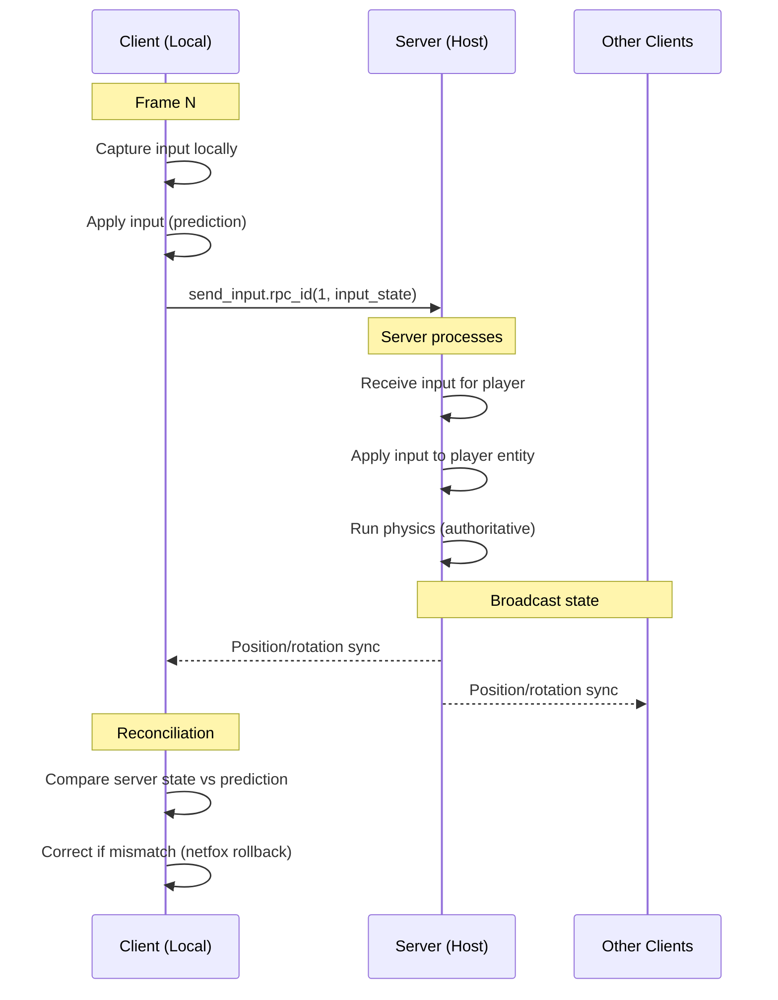
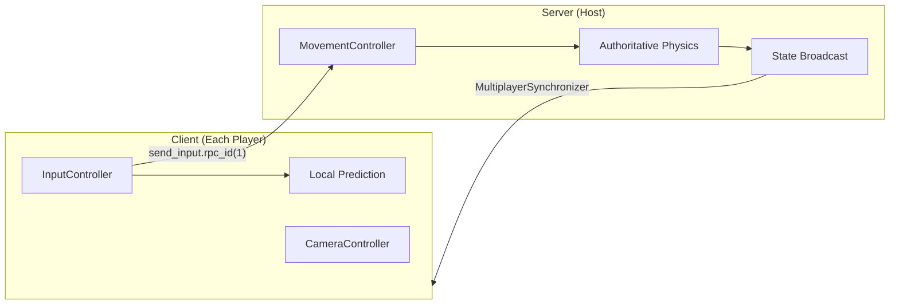

# Architecture / Design

> How the game works under the hood

## High Level

### Tips for me:

- [ ] Think about how to use composition in game, like x has a y. Think golang struct has a struct. I.e. dog has age/walk anim/collider handler/etc components. When something spawns in, it has a popanim component that plays,
- [ ] I don't have to write code the godot way, e.g. load/save my own files without nodes. Use until funcs
- [ ] hand write the code & plan structure. Don't import moto-poc, but re-create it using better systems
- Use spatial comments (debug notes in the level itself)

#### Debug levels

- See @level_manager's Console cmd
  - \` then `dbg_gym` to load that test level right from the main menu

### Stuff to plan out:

- Filesystem / folder structure
- Gameplay Loop w/ Flowcharts
- Code Structure
  - Signal Buses
- different systems that are needed
- How different systems work together
- Save system (use my own json instead of following godot's recursive way like G&L)
- NPC AI (traffic)
- multiplayer
- MORE

### Features to plan out:

- Tutorials via challenges
  - Teach how to shift, do tricks, and physics of braking via examples.
  - Speed up to 60 then take this corner at the apex, brake progressively

## Nitty-Gritty

### Godot groups

- `utils/constants.gd` has a map of Group name to group name. This should be used whenever accessing a group name so we're sure it exists.

### Translation / Localization

- Source for strings is `localization/localization.csv`
  - This CSV is auto-imported to .translation files
- Using in UI:
  - Use the key_name from the csv, it should auto-swap.
- Using in code:
  - `DebugUtils.DebugMsg(tr("<key_name>"))`

### Editor Validation

- Click "Run Validation" on the `MainGame` node inspector to check for common wiring bugs
- Validates: null `@export` objects, missing `@onready %UniqueNode` references, `@onready` Buttons without `_on_<name>_pressed()` handlers, LevelManager enum/dict sync
- Comment out `@onready` declarations to skip validation on WIP features
- See `utils/validation/auto_validator.gd` for implementation

### Managers

- Managers extend `BaseManager` and are in the "**Managers**" group. _See constants.gd_
- How to use:
  - Create Node under `ManagerManager` Node, rename to class name of the manager. e.g. `MenuManager` node uses `menu_manager.gd` which is `MenuManager` `class_name`

### State Machine

- Managers can have a State Machine, this will transition between different states
  - e.g. MenuManager can be in MainMenuState, or SettingsMenuState, etc.
- How to use:
  - Create Node, attach StateMachine script
  - Children of this Node that are States will automatically be registered
  - Transitioning of states happens via State.transitioned() signal, or request_state_change() func
  - New States can be registered / deregistered to be managed by the state machine
  - States can receive data via `StateContext` - a base class for passing typed data between states
    - Create a subclass with properties and static factory methods (see `lobby_state_context.gd`)
    - Pass context when emitting: `transitioned.emit(target_state, MyContext.NewSomething(...))`
    - Receive in `Enter(state_context: StateContext)` and cast to your type
  - States get a `state_machine_ref` property set on registration

#### Menu State Machine System

Menus use the state machine pattern where each screen is a `MenuState` extending `State`.

##### Creating a New Menu State

> Follow other files for example.

- Create new scene > `MenuState` type
  - Name it `<TYPE>MenuState`, save to `menus/...` as `<type>_menu_state.tscn`
- Create script with `<type>_menu_state.gd` as the name
  - Give it the `class_name` `<TYPE>MenuState` extends `MenuState`
- Add a `Control` node, name it `%UI`

- `@export var menu_manager: MenuManager` + target states. (see other files)
  - In `Enter()`: call `ui.show()`, connect button signals
  - In `Exit()`: call `ui.hide()`, disconnect button signals
  - Transition via `transitioned.emit(target_state)` or `transitioned.emit(target_state, context)`
- Add this new scene in the state machine
  - Add as a child of the StateMachine node
  - Wire up the exports in inspector (menu_manager, navigation targets)

#### Key Rules

- All MenuStates **must** have a `%UI` Control node (unique name)
- Set `initial_state` on StateMachine to define the default menu
- Connect signals in `Enter()`, disconnect in `Exit()` to avoid duplicate connections

### Level Manager

Levels are managed via `LevelManager` and selected through the `LobbyMenuState` MenuState. Levels are PackedScenes that are loaded & configured in `level_manager.gd`

#### Components

- **LevelManager** (`managers/level_manager.gd`)
  - `LevelName` enum - defines all available levels
  - `possible_levels` - Dictionary mapping `LevelName` -> preloaded `PackedScene`
  - `level_name_map` - Dictionary mapping `LevelName` -> localization key string
  - `@export spawn_node` - Node3D where levels are instantiated

> Note - Level enum idx 0 is `LEVEL_SELECT_LABEL` (not a real level, used for dropdown default)

- **LobbyMenuState** (`menus/lobby_menu/`) - Level selection UI
  - `LevelSelectBtn` (OptionButton) - Dropdown for level selection
  - `StartBtn` - Triggers level spawn

#### Adding a New Level

1. Create level scene extending `LevelDefinition` (no need to wire `level_manager` export - it's set automatically on spawn)
2. Add entry to `LevelName` enum in `level_manager.gd`
3. Add entry to `level_name_map` (enum -> localization key)
4. Add entry to `possible_levels` (enum -> `preload("res://path/to/level.tscn")`)

### Input System

The `InputStateManager` (`managers/input_state_manager.gd`) is a centralized input handler that routes input based on the current game context.

#### Input States

```gdscript
enum InputState {
    IN_MENU,           # Player is in a menu, ESC navigates menus
    IN_GAME,           # Player is playing, ESC triggers pause
    IN_GAME_PAUSED,    # Game is paused, ESC resumes game
    DISABLED,          # All input is disabled
}
```

#### Input Routing

The InputStateManager uses `_unhandled_input()` to process events based on `current_input_state`:

- **IN_GAME**: "pause" action -> emits `pause_requested` signal
- **IN_GAME_PAUSED**: "pause" action -> emits `unpause_requested` signal
- **IN_MENU**: "ui_cancel" action -> delegates to current MenuState's `on_cancel_key_pressed()`
- **DISABLED**: Ignores all input

#### Mouse Cursor Control

Mouse visibility is managed based on input state:

- **IN_MENU** or **IN_GAME_PAUSED**: Mouse visible (`MOUSE_MODE_VISIBLE`)
- **IN_GAME** or **DISABLED**: Mouse captured (`MOUSE_MODE_CAPTURED`)

#### Signals

- `input_state_changed(new_state: InputState)` - Fired when state changes
- `pause_requested` - Fired when player wants to pause (IN_GAME + pause action)
- `unpause_requested` - Fired when player wants to resume (IN_GAME_PAUSED + pause action)

### Player Entity

`PlayerEntity` is a `CharacterBody3D` using composition with `@export` component references. All controllers are called sequentially from `_rollback_tick()` via their `on_movement_rollback_tick()` methods.

For detailed design docs see:

- [PlayerController.md](./PlayerController.md) - movement, gearing, tricks, crash subsystems
- [AnimationController.md](./AnimationController.md) - procedural animation, IK, ragdoll
- [ComboAndBoost.md](./ComboAndBoost.md) - trick combos, boost economy, scoring, tunables

#### Component Controllers

| Controller            | File                                  | Purpose                                                 |
| --------------------- | ------------------------------------- | ------------------------------------------------------- |
| `InputController`     | `controllers/input_controller.gd`     | Gathers input, syncs via RollbackSynchronizer           |
| `MovementController`  | `controllers/movement_controller.gd`  | Physics-based movement, speed, steering, lean, velocity |
| `GearingController`   | `controllers/gearing_controller.gd`   | Clutch engagement, RPM blending, power output           |
| `TrickController`     | `controllers/trick_controller.gd`     | Detects wheelie/stoppie, owns combo accrual             |
| `BoostController`     | `controllers/boost_controller.gd`     | Boost meter: commit-on-press burn, spend, crash void    |
| `CrashController`     | `controllers/crash_controller.gd`     | Brake grab detection, crash detection, auto-respawn     |
| `CameraController`    | `controllers/camera_controller.gd`    | FPS/TPS camera switching                                |
| `AnimationController` | `controllers/animation_controller.gd` | Procedural animation blending, IK, ragdoll              |
| `HUDController`       | `controllers/hud_controller.gd`       | Wires controller signals to on-screen HUD               |
| `SkidmarkController`  | `controllers/skidmark_controller.gd`  | Local-only skidmark ribbon VFX while drifting           |

`IKController` (FABRIK solver) and `RagdollController` (PhysicalBone3D skeleton) live under `player/characters/scripts/` and are driven by `AnimationController`.

#### Synced State (via RollbackSynchronizer)

- **Physics**: `speed`, `roll_angle`, `pitch_angle`
- **Gearing**: `current_gear`, `current_rpm`, `clutch_value`, `is_rev_limited`
  - `is_rev_limited` is synced because the rule is: **every var mutated inside the rollback tick that affects simulation must be a state property** — resimulation can't rewind what netfox doesn't record. The limiter gates power output, so leaving it unsynced rubberbanded gear shifts (the auto box shifts just under the limiter cut, so the flag flaps exactly then).
- **Boost** (`%BoostController:*`): `boost_amount` (in segments), `boost_burn_target`, `boost_burn_rate`, `boost_prev_held`, `is_boosting`
- **Combo** (`%TrickController:*`): `combo_time`, `combo_grace`, `combo_boost_earned`, `combo_multiplier`
- **Crashes**: `is_crashed`

State is registered as `%Controller:var` and lives on the controller that owns the domain. netfox constrains *when* a var may be written (inside the rollback tick), not where it lives — only `is_crashed` and the discrete actions below sit on `PlayerEntity` itself.
- **Discrete actions**: `rb_do_respawn` (rollback pattern); `rb_respawn_transform` / `rb_respawn_transform_oneshot` carry the target respawn transform. Gear shifts sync `nfx_target_gear` (absolute requested gear) as netfox input — never edge-triggered flags, which drop/double-apply under stale-input reuse on the server.

#### GearingController

- Tracks clutch engagement (0-1), blends between throttle-driven and wheel-driven RPM
- Gear shifts applied from `input_controller.nfx_target_gear` each rollback tick
- **Automatic transmission** (`auto_transmission` setting) is a client-side input assist in `InputController._auto_shift()`, NOT a GearingController feature — `nfx_target_gear` is a netfox *input* property owned by the local client, so the server must never write it. Upshift/downshift RPM ratios and the between-shift cooldown are consts on `InputController`; the upshift threshold sits just under the rev-limiter cut so the auto box shifts instead of bouncing off it. Forced on while `BoostController.is_boosting`, whatever the setting says.
- Power output = throttle x power_curve x torque_multiplier x engagement
- Gear ratios, max_rpm, idle_rpm, stall_rpm are defined in `BikeSkinDefinition`

#### TrickController

```gdscript
enum Trick { NONE, WHEELIE_SITTING, WHEELIE_MOD, STOPPIE, BACKFLIP, FRONTFLIP, THREESIXTY, HEEL_CLICKER, HIGH_CHAIR, TWO_LEFT_FEET, DRIFT }
```

- Detects tricks via `pitch_angle` threshold checks against bike definition limits
- Wheelie: RPM + throttle + lean detection + clutch-kick window (0.4s)
- Stoppie: Front brake + forward lean
- Emits `trick_started`, `trick_ended` signals
- Auto-balances pitch on ground with `move_toward()` smoothing
- Detection only — scoring lives in `TrickManager` (see below)

### Trick Manager

> Full breakdown + every tunable: [ComboAndBoost.md](./ComboAndBoost.md)

Earn, spend and bank have three separate owners, and the split is **not** optional:

- **Per-tick accrual → `TrickController._accrue_combo()`** (rollback). The combo vars and `BoostController.boost_amount` are netfox state properties, and `RollbackSynchronizer._before_tick()` re-applies every state property from history each tick. A manager writing them from `_process()` is overwritten before anything accumulates — this was a real bug, don't reintroduce it. Tuning lives in consts (`BOOST_PER_SEC`, `COMBO_GRACE_SECS`, `COMBO_MULT_THRESHOLDS`), not `@export`s, so every peer simulates identically.
  - Any trick accrues; the multiplier steps at `COMBO_MULT_THRESHOLDS` seconds of unbroken trick time; dropping every trick starts the grace window so chains survive. A crash freezes accrual (the rollback tick bails on `is_crashed`) and the respawn's `do_reset()` clears the combo.
- **Scoring → `TrickManager`** (`managers/trick_manager.gd`, server-only `_process()`). Watches those synced values and banks a score the frame `combo_time` returns to zero: `duration × points_per_second × peak_multiplier`. Banking on the combo-end edge keeps scoring out of the rollback path entirely, so resimulation can't double-count it.
  - **Crashing voids the run** — no partial credit. Checked before the `combo_time` test, because a crash freezes `combo_time` and only zeroes it at the respawn; without that ordering a crashed run would bank on the way down like a clean finish.
  - Gamemode-agnostic: gamemodes call `get_score(peer_id)` and `reset_peer(peer_id)`. Signals: `combo_banked(peer_id, points, duration, multiplier)`, `combo_voided(peer_id, lost_duration, lost_points)`.
- **Spending → `BoostController`** (rollback), which owns the meter vars — see [PlayerController.md](./PlayerController.md).

#### CrashController

Monitors for crash conditions:

- Lean angle > 80 degrees
- Pitch angle > max_wheelie_angle_deg or < -max_stoppie_angle_deg
- Brake grab while turning (rapid brake engage + lean > 15 degrees)

`trigger_crash()` sets `is_crashed = true`, starts ragdoll, 3s auto-respawn timer.

#### AnimationController

```gdscript
enum RiderState { RIDING, IDLE, RAGDOLL }  # TRICK is stubbed/disabled — skeleton anims not yet wired into the pose pipeline
```

- **Procedural animation**: Smooths visual_lean, visual_pitch, visual_yaw each frame
  - `visual_root.rotation.x` = pitch (wheelie/stoppie)
  - `visual_root.rotation.z` = lean (turning)
  - Chest rotates with lean for rider weight shift
- **IK**: `IKController` handles hand/foot/head positions via markers on BikeSkinDefinition
- **Ragdoll**: `RagdollController` creates skeleton bodies for crash physics

#### Skin System

See [Skins.md](./Skins.md)

### Pause System

User stories:

- In SP or MP, hitting **PAUSE** should:
  - Open the pause menu
  - Show the Mouse / allow gamepad to control menus
  - Allow you to change settings
  - Allow you to go to the main menu
  - Customize your character (progression depends on mode)
- In Singleplayer, hitting **PAUSE** should:
  - Freeze the gameplay & pause whole world
  - Allow you to save game
  - Allow you to load game
- In Multiplayer, hitting **PAUSE** should:
  - Freeze your character? Turn half-invisible w/o hitbox
  - Allow you to invite friends to server
  - Allow you to change servers

#### Input & Pause Interaction

The `PauseManager` (`managers/pause_manager.gd`) coordinates InputManager, MenuManager, and LevelManager:

- **Pause** (`pause_requested`): Sets state to `IN_GAME_PAUSED`, shows pause menu, enables MenuManager processing, disables LevelManager processing
- **Unpause** (`unpause_requested`): Sets state to `IN_GAME`, hides menus, disables MenuManager processing, enables LevelManager processing

The same "pause" action triggers different behavior based on `InputState`.

### Audio Manager

- `AudioManager` (`managers/audio_manager.gd`) - custom Godot audio middleware (replaced FMOD, web-export friendly). See [AudioMiddleware.md](./AudioMiddleware.md)
- Maps settings keys to audio bus volumes (e.g. `"master_vol"` → `Master` bus)
- `update_ninja500_rpm(rpm_ratio)` - sets RPM parameter for seamless engine sound looping
- Listens to `SettingsManager.setting_updated` / `all_settings_changed` to sync bus volumes

### Settings Manager

- `SettingsManager` (`managers/settings_manager.gd`) - JSON persistence to `user://settings.json`
- Default settings: signal_relay_host, resolution_scale, fullscreen_mode, master_vol, music_vol, menu_vol, sfx_vol, cam_mode, invert_cam, mouse_cam_sens, joy_cam_sens, difficulty, auto_transmission (username / skins live in save data, not settings)
- Signals: `setting_updated(key, value)`, `all_settings_changed(dict)`
- Used by AudioManager (volume), ConnectionManager (signal relay host)

### Gamemode Manager

- `GamemodeManager` (`managers/gamemodes/gamemode_manager.gd`) - manages match state, coordinates level/spawn. Runs a **state machine of gamemodes**.
- **Gamemode states** (extend base `GameModeType`, whose `Kind` enum is the canonical id, live under `managers/gamemodes/types/`):
  - `FreeRoamGameMode` - open play, event circles trigger mode switches, respawn on crash. Crash respawns return you to the crash site (upright, same heading) — unless the site is steep or void, in which case you go to your last flat-ground breadcrumb (the server samples one per player on gentle ground; the ground check excludes the bike's own collider and ragdoll bones)
  - `RoadRaceGameMode` - lap-based race built on the task/runner system (see [RaceModes.md](./RaceModes.md)). Bots keep racing through the results countdown; result rows refresh live until the timer ends (human rows are snapshotted before the runner stops — `TaskRunner.stop()` clears its per-player state)
  - `StreetRaceGameMode` - the same race run through live ambient traffic (duplicated file, not a subclass)
  - `TutorialGameMode` - step-by-step progression with countdown + trick detection
  - `ChallengeGameMode` - lightweight in-world trick challenges (no countdown/results)
- Events run via a composable **task/runner system** (`GameModeTask` leaves + `SequentialTaskRunner` / `ConcurrentTaskRunner`), authored in level scenes. See [GamemodeSystem.md](./GamemodeSystem.md)
- Context passed between gamemode states via `GamemodeStateContext`
- RPCs for multiplayer sync:
  - `start_game(level_name)` - server calls on all peers; ignores anything sent by a client
  - `_sync_game_to_late_joiner(level_name, gamemode, ...)` - sync level to late-joining client (authority-mode RPC, server → one peer)
  - `_request_late_spawn(peer_id)` - late-joiner requests their player spawn; a peer may only request its own
- **`change_gamemode()` is the single entry point for transitions.** It is the only thing that calls the `_rpc_transition_gamemode` broadcast — gamemodes returning to free roam go through it too, so every transition passes the same guards. Calling the broadcast directly bypasses them.
- **Late-join contract**: `GameModeType.is_late_joinable()` (default false, true on `FreeRoamGameMode`). A peer joining mid-race is synced into free roam on the same level instead of the live race — races need mid-match context (start circle, runner state) the joiner has no way to reconstruct, and dropping them straight in crashed the client on a null `event_start_circle`. They still spawn and ride; when the race ends, everyone transitions to free roam and the joiner's same-state transition is a harmless no-op.
- While a non-late-joinable mode is running, `change_gamemode()` accepts only a return to `FREE_ROAM`. That stops a free-roaming late joiner from driving into an event circle and restarting the mode out from under a live race.

### Save Manager

- `SaveManager` (`managers/save_manager.gd`) - JSON persistence of player save data with version tracking
- Owns the local `PlayerDefinition` (username, bike/character skins, progression)
- Distinct from `SettingsManager` (which handles device/UI settings)

### Spawn Manager

- `SpawnManager` (`managers/spawn_manager.gd`) - player spawning/despawning
- RPCs:
  - `rpc_spawn_player(peer_id, player_def_dict)` - spawn broadcast
  - `rpc_despawn_player(peer_id)` - despawn broadcast
  - `respawn_player(peer_id)` - broadcast: every peer sets `rb_do_respawn` on their local player so `do_respawn()` runs everywhere (resets ragdoll/visual state on clients, not just server-synced transform)
  - `crash_player(peer_id)` - broadcast: sets `rb_do_crash` everywhere; sent by whoever rammed the victim (slide collisions only report what YOU moved into)
  - `respawn_player_at(peer_id, pos, basis)` - respawn AND store the persistent respawn point
  - `respawn_player_in_place(peer_id, pos, basis)` - one-shot respawn transform, persistent point untouched (free-roam crash respawns)
  - `set_respawn_point(peer_id, pos, basis)` / `reset_respawn_point(peer_id)` - update/clear the persistent respawn point without teleporting (race checkpoints / entering free roam)
  - `request_respawn()` - the one client-callable entry point (pause-menu button). The server derives the target from the RPC sender, so a client can never respawn anyone but itself
- **Sender guards**: the broadcast RPCs above stay `any_peer` only because the server has to `call_local` them, and each rejects any sender that isn't the server. Note the mechanic this relies on — during `call_local` execution the sender id is the *local* peer's own id, so it reads as 1 on the host and as the client's own id (and is therefore rejected) on a client. Any new client-side caller needs a `request_*` entry point rather than a direct broadcast.
- Local helpers: `add_player_locally()`, `remove_player_locally()`, `spawn_all_players()`

### NPC Race Manager

- `NPCRaceManager` (`managers/npc_race_manager.gd`) - owns AI race riders (`NPCRiderEntity`) on a negative-id roster (ids from -1) with spawn/despawn RPCs mirroring `SpawnManager`. The race gamemodes drive its lifecycle; the server-only AI tick points each NPC at its next checkpoint from `RaceTask`.
- Late joiners get every live bot re-sent at its current transform via `sync_npcs_to_peer(peer_id)` (called from the race gamemodes' `_on_player_latejoined`) — without it the newcomer has no bot nodes and takes a MultiplayerSynchronizer error per packet per bot.

### NPC Traffic Manager

- `NPCTrafficManager` (`managers/npc_traffic_manager.gd`) - ambient traffic riders/cars (ids from -1000, so race and traffic ids can never collide). Builds a `TrafficRouteGraph` from the level's road network; count, car/bike mix, cruise speed and vehicle rosters are per-map via `LevelDefinition.traffic_settings` (a `TrafficSettings` resource). `FreeRoamGameMode` and `StreetRaceGameMode` start/stop it, server-only.
- **Spawn sync contract** (this is the fix for "traffic only loads for host"):
  - The server broadcasts `rpc_spawn_npc`, but clients only *accept* spawns after their own gamemode `Enter()` runs (level guaranteed loaded) — earlier broadcasts would parent riders under the outgoing level and be freed with it.
  - On `Enter()`, non-server peers call `request_traffic_sync()` to pull everything they missed (covers both the fresh-start timing race and late join); `Exit()` calls `reset_local_traffic()`.
  - Spawn/despawn RPCs are idempotent (dedupe on npc id / tolerant of missing ids), so broadcast + resync can overlap safely.
- Crashed riders recover onto a clear lane spot after a randomized delay; a rider that rams a player crashes them via `SpawnManager.crash_player`.
- Vehicle skins ship as `res://` paths, deliberately not `PlayerDefinition.to_dict()` — that round-trips through `BikeSkinDefinition.from_dict()`, which writes a `.tres` into `user://skins/` per rider per peer (open issue, see code-review-20260430.md).

#### NPC transform sync + render smoothing

Shared by both NPC managers, implemented on `NPCRiderEntity`. NPCs use a plain `MultiplayerSynchronizer` (server authority) with **no** netfox rollback or TickInterpolator.

- The replicated property is `sync_transform`, not the node's raw transform. The server writes it at the end of every movement tick (all three behavior states route through `apply_gravity_and_move()`) and on `teleport_to()`.
- Nothing renders straight off it. A body that only moves on the tick reads as stepping at render rate — the player bike doesn't, because netfox's TickInterpolator smooths it, and that gap is what this closes for NPCs. Both peers ease toward `sync_transform` in `_process()`, with different math because they know different things:
  - **Server** knows both ends of the step, so it interpolates exactly between the last two authoritative poses by the physics interpolation fraction. One tick of visual latency and no more, so what you see still lines up with what you collide with.
  - **Client** only ever knows the latest pose, arriving at replication rate on irregular timing, so it eases toward it exponentially. Jumps past a snap threshold (teleport / crash recovery) snap instead of sliding across the map.
- The server puts the body back on `sync_transform` in its own `_physics_process` before the behavior states run, so steering and `move_and_slide()` never see a smoothed pose. That restore has to land first, which is why the entity sets a negative `process_physics_priority` rather than relying on parent-before-child order alone.
- Clients never simulate: `_ready` disables the behavior state machine's physics on non-server peers.

### Unlocks / progression

#### WIP NOTES

- Singleplayer unlocks mods / cosmetics (aka 100% skin), and that unlocks skins for SP and MP
- Bikes unlock per SP/MP

- Playing SP unlocks bikes for MP?
- Playing MP unlocks skins for SP, but not bikes

### Customizing

- Have an in-world garage like LS Customs
- Pause menu btn teleports you to the garage

## Multiplayer Networking Architecture

### Authority Model: Client-Predicted, Server-Authoritative


```mermaid
sequenceDiagram
    participant C as Client (Local)
    participant S as Server (Host)
    participant O as Other Clients

    Note over C: Frame N
    C->>C: Capture input locally
    C->>C: Apply input (prediction)
    C->>S: send_input.rpc_id(1, input_state)

    Note over S: Server processes
    S->>S: Receive input for player
    S->>S: Apply input to player entity
    S->>S: Run physics (authoritative)

    Note over S,O: Broadcast state
    S-->>C: Position/rotation sync
    S-->>O: Position/rotation sync

    Note over C: Reconciliation
    C->>C: Compare server state vs prediction
    C->>C: Correct if mismatch (netfox rollback)
```

### What Runs Where


```mermaid
flowchart LR
    subgraph Client["Client (Each Player)"]
        IC[InputController]
        Predict[Local Prediction]
        Cam[CameraController]
    end

    subgraph Server["Server (Host)"]
        MC[MovementController]
        Physics[Authoritative Physics]
        Sync[State Broadcast]
    end

    IC -->|"send_input.rpc_id(1)"| MC
    IC --> Predict
    MC --> Physics
    Physics --> Sync
    Sync -->|"MultiplayerSynchronizer"| Client
```

### Authority Summary

| Component                   | Runs On                | Authority                  |
| --------------------------- | ---------------------- | -------------------------- |
| `InputController` (capture) | Local client only      | Client                     |
| `InputController` (sync)    | Local client -> Server | Client sends, netfox syncs |
| `MovementController`        | Server only            | Server                     |
| `GearingController`         | Server only            | Server                     |
| `TrickController`           | Server only            | Server                     |
| `CrashController`           | Server only            | Server                     |
| `AnimationController`       | Local client only      | Client (visual only)       |
| `CameraController`          | Local client only      | Client                     |
| Position/Rotation           | Server broadcasts      | Server                     |
| Lobby state                 | Server broadcasts      | Server                     |

### Terrain3D collision under server authority

Terrain3D's default collision is dynamic — built around **one tracked camera** (`CameraController.switch_to_cam` hands it the local player's camera). That's fine for a client predicting only itself, but the server simulates **every** player's physics, so remote players ride over collision-less terrain and fall through. `LevelDefinition._ready()` therefore forces `terrain.collision.mode = Terrain3DCollision.FULL_GAME` on the server (memory for correctness); clients keep the cheap camera-tracked mode. The "Cannot find the active camera" push_error at level load is benign — it fires before the player camera exists, and the hand-off on spawn restarts Terrain3D's processing.

### Connection Modes

All modes are **server-authoritative** — the host runs physics, clients predict + reconcile. Mode only affects transport.

- **WEBRTC** *(default)*: WebRTC peer connections via a custom signaling server (`signal_relay_host`), works for both native and browser clients. Handled by `MultiplayerWebRTC`. See [LobbyGameFlowMP.md](./LobbyGameFlowMP.md)
- **IP_PORT**: Direct IP/ENet connection to port 42068. Handled by `MultiplayerIPPort`.
  - Fetches public IP via ipify.org API (or private IP in debug)

### RPC Signatures

**InputController** - Client -> Server (synced via RollbackSynchronizer):

Input is gathered locally by `InputController._gather()` and synced automatically by netfox's `RollbackSynchronizer`. No manual RPC needed - netfox handles input sync and rollback.

**LobbyManager** RPCs:

- `update_player_metadata(peer_id, player_def_dict)` - client sends PlayerDefinition to server
- `_sync_lobby_players(players_dict)` - server broadcasts full lobby dict

**GamemodeManager** RPCs:

- `start_game(level_name)` - server calls on all peers
- `_sync_game_to_late_joiner(level_name, gamemode, ...)` - sync level to late-joining client
- `_request_late_spawn(peer_id)` - late-joiner requests their player spawn

See the [Gamemode Manager](#gamemode-manager) section for the sender guards, the late-join contract, and why `change_gamemode()` is the only way to start a transition.

**SpawnManager** RPCs: see the [Spawn Manager](#spawn-manager) section for the full list (spawn/despawn broadcasts plus the respawn/crash/respawn-point family) and the server-sender guard rule.

### Deployment / builds

- Godot 4.6+ is required
- Audio uses a custom Godot middleware — no FMOD dependency (see [AudioMiddleware.md](./AudioMiddleware.md))
- Deploying new version
  - Run `./deploy-version.sh` (any OS) to create a new version tag & push to github to run CI
  - See [build.yml](../../.github/workflows/build.yml)
