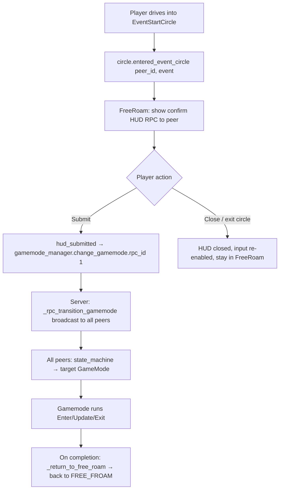
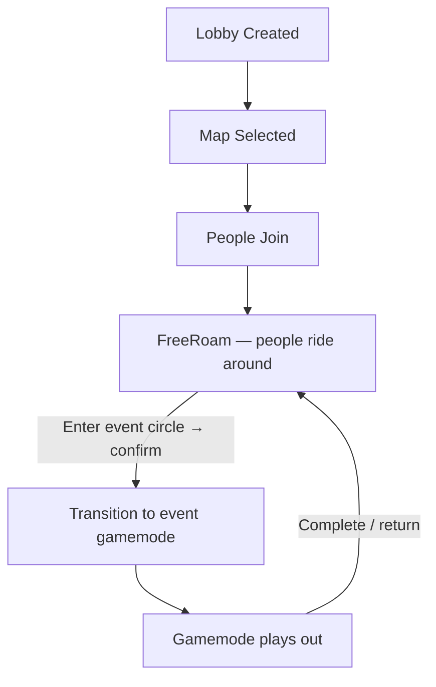

# Gamemode System

## Overview

A **GameMode** is a `State` node under `GamemodeManager`'s state machine. One gamemode is active at a time across all peers. Events are placed in the world as **EventStartCircles**; driving into one opens a confirm HUD; submitting transitions the lobby into the target gamemode.

Everyone in the lobby plays the same gamemode together. Free roam is the default/lobby state.

## Core Pieces

| Piece | File | Role |
|---|---|---|
| `GamemodeManager` | `managers/gamemodes/gamemode_manager.gd` | Owns match state, `TGameMode` enum, state machine, late-joiner sync |
| `GameMode` (base) | `managers/gamemodes/gamemode.gd` | `State` subclass; server-authoritative |
| `FreeRoamGameMode` | `.../free_roam/` | Default mode. Wires event circles → confirm HUD → transition |
| `TutorialGameMode` | `.../tutorial/` | Scripted step sequence (`TutorialSteps`), per-peer, countdown start |
| `StreetRaceGameMode` | `.../street_race/` | Stub |
| `GameModeEvent` (Resource) | `resources/events/gamemode_event.gd` | `name`, `description`, `target_gamemode: TGameMode` |
| `EventStartCircle` | `levels/components/event_start_circle.gd` | `Area3D` with a `GameModeEvent` export; emits enter/exit signals |
| `GameModeEventConfirmHUD` | `managers/gamemodes/hud/` | Per-peer RPC'd confirm dialog (submit / close) |
| `GamemodeStateContext` | `utils/state_machine/` | Carries `peer_id` (and optionally `gamemode_event`) through state transitions |

`TGameMode`: `FREE_FROAM, STREET_RACE, STUNT_RACE, TUTORIAL`. `_gamemode_map` in `GamemodeManager` wires the enum to the `GameMode` node instances.

## Event Trigger Flow (FreeRoam → Event)



While the HUD is open, `input_state_manager` is set to `IN_GAME_PAUSED`. The HUD is a singleton in `main_game.tscn`; `FreeRoamGameMode` connects to its `hud_submitted` / `hud_closed` signals per-interaction.

## Network / Authority

- All gamemodes are **server-authoritative** — `Update()` early-returns on clients.
- Gamemode change: client calls `change_gamemode.rpc_id(1, enum, peer_id)` → server calls `_rpc_transition_gamemode.rpc(...)` (`call_local`, reliable) → every peer's state machine transitions in lockstep.
- Late-joiner: `GamemodeManager._sync_game_to_late_joiner` (sent by server on client connect when `match_state == IN_GAME`) sets level + gamemode and transitions the joiner's state machine; the joiner then requests `_request_late_spawn`, and the active gamemode handles actual spawn via `player_latejoined` → `gamemode_manager.latespawn_player`.

## Manager Signals (consumed by each GameMode)

`GamemodeManager` re-emits these for whichever gamemode is active to listen:

- `player_spawned(peer_id)`
- `player_crashed(peer_id)` — gamemodes decide respawn policy (FreeRoam: respawn in place after delay; Tutorial: respawn at start marker + reset progress)
- `player_latejoined(peer_id)` — usually forwarded to `latespawn_player`
- `player_disconnected(peer_id)` — despawn if `IN_GAME`; Tutorial also returns to FreeRoam if the target peer leaves

Connect in `Enter()`, disconnect in `Exit()`.

## Adding an Event

1. In the level scene, instance `levels/components/event_start_circle.tscn` at the desired location.
2. Create an inline `GameModeEvent` sub-resource on the circle's `gamemode_event` property. Fill `name` / `description` (localization keys) and `target_gamemode`.
3. If the target gamemode needs a spawn point, add a uniquely-named `Marker3D` (e.g. `%Tutorial01StartMarker`) and reference it from that gamemode's code.

Example (from `test_city_01.tscn`):
```
[sub_resource type="Resource" id="Resource_asds5"]
script = ExtResource("gamemode_event.gd")
name = "Tutorial: Moto 101"
description = "Learn the basics to get your M1 license."
target_gamemode = 3   # TUTORIAL
```

## Adding a Gamemode

1. Add to `GamemodeManager.TGameMode` enum.
2. Create `class_name FooGameMode extends GameMode`. Implement `Enter` / `Update` / `Exit`. Guard server-only logic with `multiplayer.is_server()`.
3. Add the node under the state machine in `main_game.tscn`, `@export` it on `GamemodeManager`, and register it in `_gamemode_map` in `_ready()`.
4. Connect `player_crashed` / `player_disconnected` / `player_latejoined` as needed.
5. To return to free roam, build a `GamemodeStateContext`, set `peer_id`, and call `gamemode_manager._rpc_transition_gamemode.rpc(FREE_FROAM, peer_id)` (see `TutorialGameMode._return_to_free_roam`).

## Tutorial Specifics

- `TutorialSteps` (`RefCounted`) defines the step enum, `StepDef` inner class (objective/hint keys, `check`, optional `on_enter`/`on_exit`/`get_progress` callables), and reusable check helpers.
- Sequences are `Array[Step]` constants (currently `THE_BASICS`).
- `TutorialGameMode` runs a countdown (input disabled), then ticks through the sequence against `_target_peer_id`'s player, driving `TutorialHUD` via `rpc_show_step` / `rpc_update_progress` / `rpc_show_complete`. Tricks are tracked via `TrickController.trick_started`/`trick_ended`.

## Match Lifecycle



## Out of Scope (for now)

- **Drop-in sessions** (GTA-style): anyone starts a session, countdown timer, others in lobby keep riding outside the session. Deferred until dedicated servers — a party hosting another party is awkward peer-to-peer.
- Multiple events per circle with in-circle selection (see TODO on `EventStartCircle.gamemode_event`).
