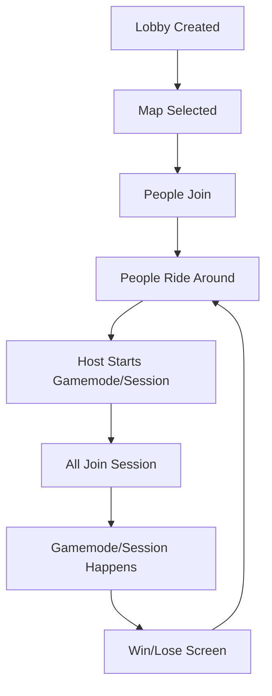

# Gamemode System

---

## IMPL
- [x] IMPL ../PLAN.md to connect & create tutorial
- [ ] Tutorials should be single player, but server should still know. only RPC to that peer though.
  - [ ] Add choice to send to single peer, or all in lobby. e.g. race vs tutorial
- [x] Move respawn to gamemode manager
- [x] Create Free Mode GameMode
- [ ] Create Event system

  - [x] Gamemode manager
  - [x] Event Start Circle
  - [x] Gamemode UI
  - [x] Use entered/exited event to show UI when entering circle
  - [ ] Set player velocity to 0
  - [ ] Select event (start)
  - [ ] Connect UI to gamemode & RPC
  - [ ] Start event

- [ ] New menu type
  - [ ] Create loading inbetween screen
  - [ ] Create win/lose inbetween screen

> See event_start_circle.gd & tutorial_gamemode.gd & free_roam_gamemode.gd & gamemode_event.gd

## Way to create game mode / sessions / events / missions

- Drive to location, press Y to open gamemode select menu

  - > Similar to Super Battle Golf/GTAOnline/Forza Horizon 5
  - Host only can click thru menus to select
  - Multiple locations have different modes / events
  - Everyone in lobby starts event when host hits start

## Lifecycle

## Ways to play

- By yourself, offline
- Solo, join open lobby
- Friends, hosting game
- Friends, joining game
- Friends, joining open lobby

## Out of scope

- "Drop in"

  - > Similar to GTA 5
  - Drive to location, press Y to open gamemode select menu
  - Anyone can click thru menus to create session, new session lobby is created with that peer_id as host
    - timer counts down till start
    - host can force start
  - Ppl can join session while timer is going
  - Everyone in lobby starts event when host hits start
  - Other people riding in lobby are still riding around, but aren't in the gamemode
  - Maybe wait for dedicated servers, since party A miight not want to host party B
