# Multiplayer Lobby & Game Flow

This document explains the complete flow of the multiplayer lobby system, from hosting/joining through game start.

## Overview

The lobby system uses ENet for networking with two connection modes:

- **Noray**: NAT traversal via relay server (default)
- **IP/Port**: Direct connection (requires port forwarding)

---

## High-Level Flow

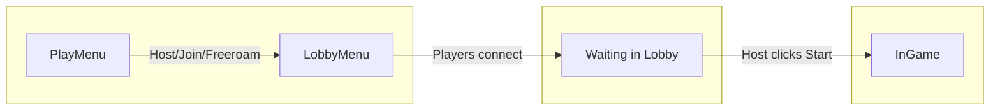

Three phases:

1. **[Phase 1: Host Starts Server](#phase-1-host-starts-server)** - Host creates server, gets invite code
2. **[Phase 2: Client Joins](#phase-2-client-joins)** - Client connects using invite code
3. **[Phase 3: Game Starts](#phase-3-game-starts)** - Host starts, all peers spawn into level

---

## Phase 1: Host Starts Server

When the host clicks "Host" in PlayMenu:

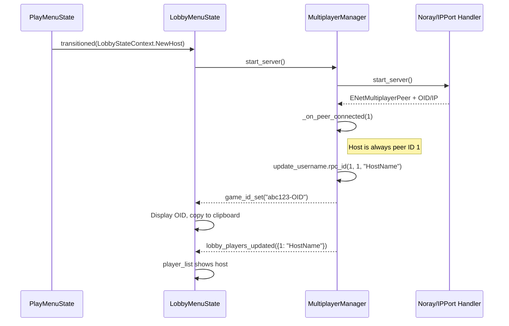

**Result**: Host sees lobby with their name, invite code displayed and copied to clipboard.

---

## Phase 2: Client Joins

When client enters the invite code and clicks "Join":

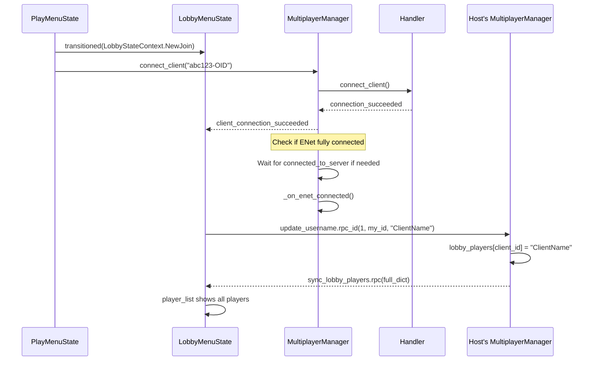

**Result**: Both host and client see full player list with usernames.

---

## Phase 3: Game Starts

When host clicks "Start":

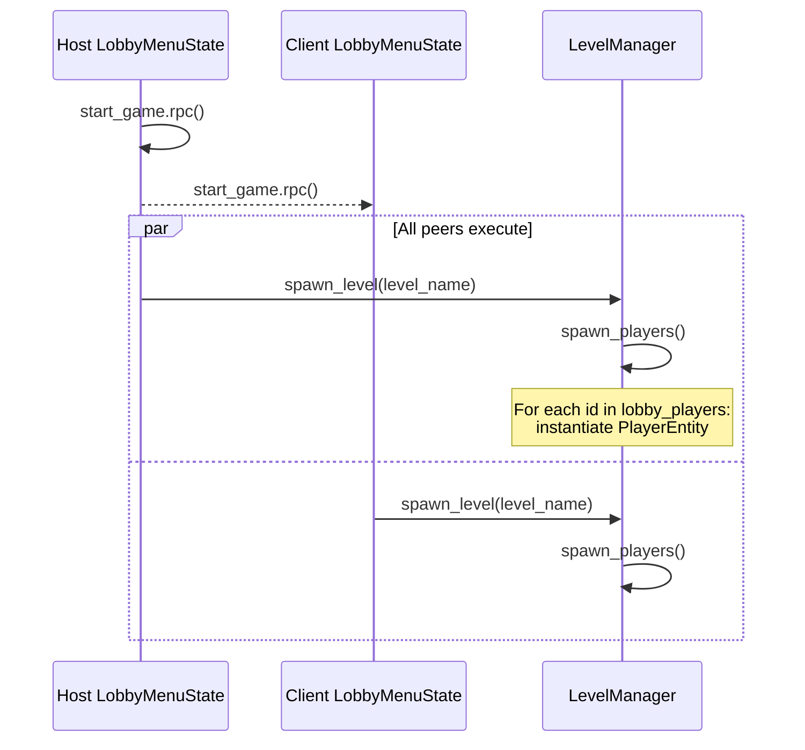

**Result**: All peers load the same level with all players spawned.

---

## Deep Dive: Connection Signals

The system has multiple connection signals. Here's why each exists:

### Signal Timeline

```mermaid
sequenceDiagram
    participant Handler as Handler
    participant MM as MultiplayerManager
    participant Godot as Godot Multiplayer
    participant Lobby as LobbyMenuState

    rect rgb(40, 40, 60)
        Note over Handler,Lobby: Stage 1: Handler Success
        Handler->>MM: connection_succeeded
        Note right of MM: ENet peer created<br/>Handshake may be in progress
    end

    rect rgb(40, 60, 40)
        Note over Handler,Lobby: Stage 2: ENet Connected
        Godot->>MM: connected_to_server (if needed)
        MM->>MM: _on_enet_connected()
        MM-->>Lobby: client_connection_succeeded
        Note right of Lobby: NOW safe to send RPCs
    end

    rect rgb(60, 40, 40)
        Note over Handler,Lobby: Stage 3: Server Sees Peer
        Godot->>MM: peer_connected(client_id)
        MM->>MM: Add to lobby_players dict
    end

    rect rgb(60, 60, 40)
        Note over Handler,Lobby: Stage 4: Username Synced
        Lobby->>MM: update_username RPC
        MM-->>Lobby: lobby_players_updated
        Note right of Lobby: UI shows player with name
    end
```

### Signal Reference

| Signal                        | Source             | When                 | Purpose               |
| ----------------------------- | ------------------ | -------------------- | --------------------- |
| `connection_succeeded`        | Handler            | ENet peer created    | Low-level success     |
| `client_connection_succeeded` | MultiplayerManager | ENet fully connected | **Safe for RPCs**     |
| `peer_connected(id)`          | Godot              | Server sees peer     | Add to lobby dict     |
| `game_id_set(addr)`           | MultiplayerManager | Got OID/IP           | Display invite code   |
| `lobby_players_updated`       | MultiplayerManager | After sync RPC       | Update player list UI |

### Why Two Stages?

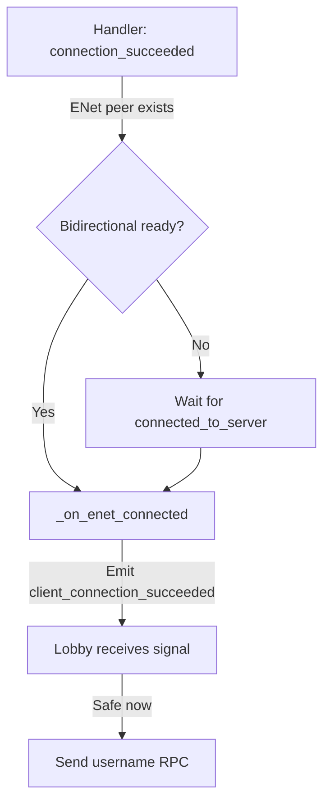

Edge cases handled:

1. Handler succeeds but ENet handshake fails
2. ENet connects but server doesn't acknowledge
3. Client tries RPC before channel ready

The ENet ready check is handled inside `MultiplayerManager._on_handler_connection_succeeded()`, so `client_connection_succeeded` only fires once the peer is fully connected and RPCs are safe to send.

Code pattern in `multiplayer_manager.gd:178-186`:

```gdscript
func _on_handler_connection_succeeded():
    if multiplayer.multiplayer_peer.get_connection_status() != MultiplayerPeer.CONNECTION_CONNECTED:
        multiplayer.connected_to_server.connect(_on_enet_connected, CONNECT_ONE_SHOT)
    else:
        _on_enet_connected()

func _on_enet_connected():
    client_connection_succeeded.emit()
```

---

## Deep Dive: Username RPC Flow

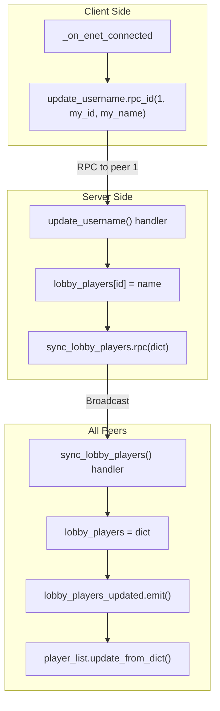

### RPC Signatures

```gdscript
# Client → Server
@rpc("any_peer", "call_local", "reliable")
func update_username(id: int, username: String):
    if !multiplayer.is_server(): return
    lobby_players[id] = username
    sync_lobby_players.rpc(lobby_players)

# Server → All
@rpc("call_local", "reliable")
func sync_lobby_players(players: Dictionary):
    lobby_players = players
    lobby_players_updated.emit(players)
```

**Why this pattern?**

- Server is authoritative (single source of truth)
- Full dict sync prevents delta bugs
- `call_local` ensures server updates its own UI
- `reliable` ensures critical data arrives

---

## Deep Dive: Level Selection Sync

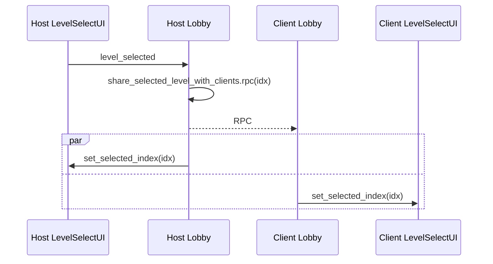

Clients see the same level selected, but only host can change it.

---

## Deep Dive: Player Spawning

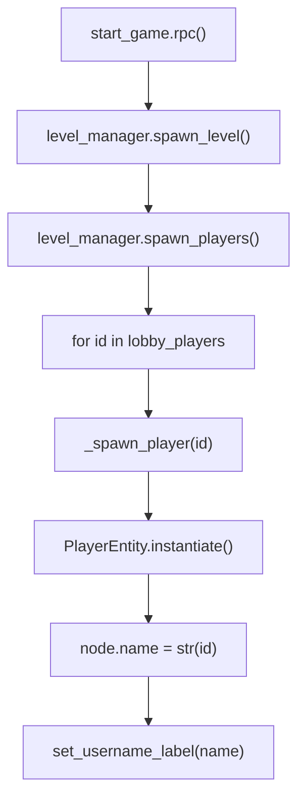

```gdscript
func _spawn_player(id: int):
    var uname = multiplayer_manager.lobby_players[id]
    var player = player_scene.instantiate() as PlayerEntity
    player.name = str(id)  # Critical for netfox sync
    current_level.player_spawn_pos.add_child(player, true)
    player.set_username_label(uname)
```

**Key detail**: Node name = peer ID, which netfox uses for rollback sync.

---

## State Machine Overview

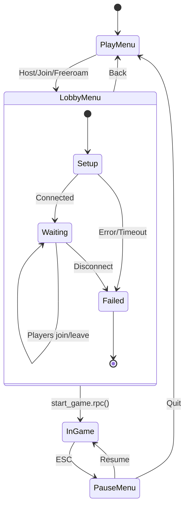

---

## Error Handling

### Connection Timeout

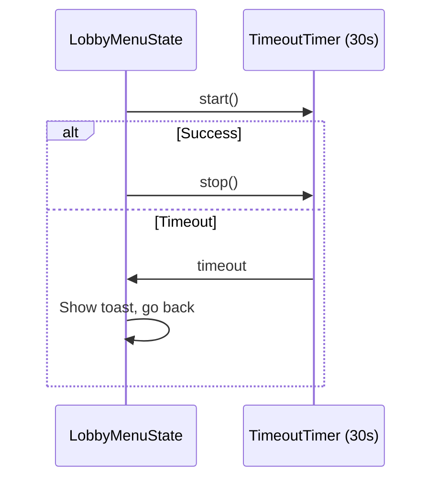

### Server Disconnect

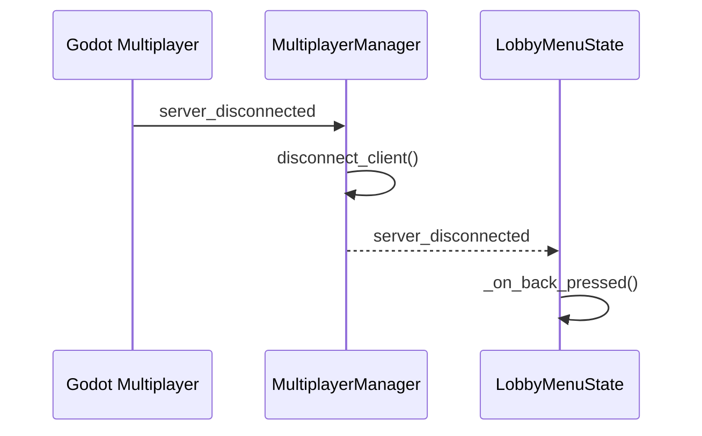

---

## Connection Mode Detection

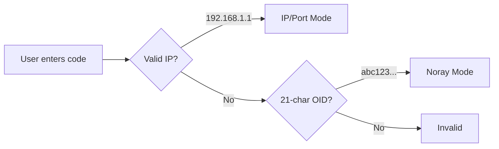

```gdscript
func _auto_detect_connection_mode(text: String):
    if text.is_valid_ip_address():
        multiplayer_manager.connection_mode = ConnectionMode.IP_PORT
    elif _is_valid_noray_oid(text):
        multiplayer_manager.connection_mode = ConnectionMode.NORAY
```

---

## Key Code Locations

| Component           | File                   | Lines   |
| ------------------- | ---------------------- | ------- |
| Host button         | play_menu_state.gd     | 106-108 |
| Join button         | play_menu_state.gd     | 111-119 |
| Server startup      | multiplayer_manager.gd | 33-49   |
| Client connect      | multiplayer_manager.gd | 70-86   |
| Username RPC        | multiplayer_manager.gd | 152-165 |
| Connection handling | multiplayer_manager.gd | 178-186 |
| Game start RPC      | lobby_menu_state.gd    | 164-168 |
| Player spawning     | level_manager.gd       | 86-99   |
| Player list UI      | player_list_ui.gd      | 15-36   |
