# Multiplayer Lobby & Game Flow

This document explains the complete flow of the multiplayer lobby system, from hosting/joining through game start.

## Overview

The lobby system uses ENet for networking with two connection modes:

- **Noray**: NAT traversal via relay server (default)
- **IP/Port**: Direct connection (requires port forwarding)

---

## High-Level Flow

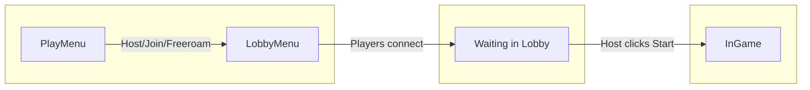
```mermaid
flowchart LR
    subgraph Phase1[" "]
        A[PlayMenu] -->|Host/Join/Freeroam| B[LobbyMenu]
    end
    subgraph Phase2[" "]
        B -->|Players connect| C[Waiting in Lobby]
    end
    subgraph Phase3[" "]
        C -->|Host clicks Start| D[InGame]
    end
```

Three phases:

1. **[Phase 1: Host Starts Server](#phase-1-host-starts-server)** - Host creates server, gets invite code
2. **[Phase 2: Client Joins](#phase-2-client-joins)** - Client connects using invite code
3. **[Phase 3: Game Starts](#phase-3-game-starts)** - Host starts, all peers spawn into level

---

## Phase 1: Host Starts Server

When the host clicks "Host" in PlayMenu:

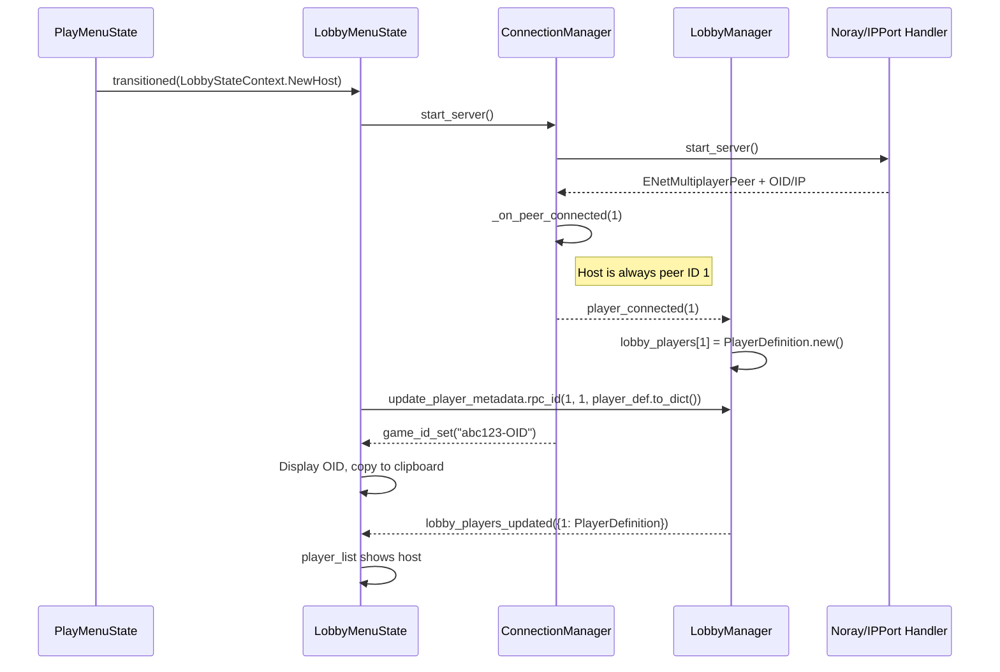
```mermaid
sequenceDiagram
    participant Play as PlayMenuState
    participant Lobby as LobbyMenuState
    participant CM as ConnectionManager
    participant LM as LobbyManager
    participant Handler as Noray/IPPort Handler

    Play->>Lobby: transitioned(LobbyStateContext.NewHost)
    Lobby->>CM: start_server()
    CM->>Handler: start_server()
    Handler-->>CM: ENetMultiplayerPeer + OID/IP
    CM->>CM: _on_peer_connected(1)
    Note right of CM: Host is always peer ID 1
    CM-->>LM: player_connected(1)
    LM->>LM: lobby_players[1] = PlayerDefinition.new()
    Lobby->>LM: update_player_metadata.rpc_id(1, 1, player_def.to_dict())
    CM-->>Lobby: game_id_set("abc123-OID")
    Lobby->>Lobby: Display OID, copy to clipboard
    LM-->>Lobby: lobby_players_updated({1: PlayerDefinition})
    Lobby->>Lobby: player_list shows host
```

**Result**: Host sees lobby with their name, invite code displayed and copied to clipboard.

---

## Phase 2: Client Joins

When client enters the invite code and clicks "Join":

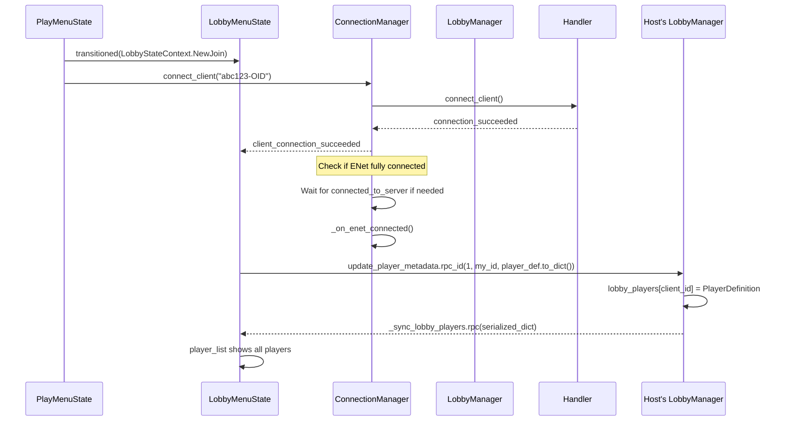
```mermaid
sequenceDiagram
    participant Play as PlayMenuState
    participant Lobby as LobbyMenuState
    participant CM as ConnectionManager
    participant LM as LobbyManager
    participant Handler as Handler
    participant HostLM as Host's LobbyManager

    Play->>Lobby: transitioned(LobbyStateContext.NewJoin)
    Play->>CM: connect_client("abc123-OID")
    CM->>Handler: connect_client()
    Handler-->>CM: connection_succeeded
    CM-->>Lobby: client_connection_succeeded

    Note over CM: Check if ENet fully connected
    CM->>CM: Wait for connected_to_server if needed
    CM->>CM: _on_enet_connected()

    Lobby->>HostLM: update_player_metadata.rpc_id(1, my_id, player_def.to_dict())
    HostLM->>HostLM: lobby_players[client_id] = PlayerDefinition
    HostLM-->>Lobby: _sync_lobby_players.rpc(serialized_dict)
    Lobby->>Lobby: player_list shows all players
```

**Result**: Both host and client see full player list with usernames and skins.

---

## Phase 3: Game Starts

When host clicks "Start":

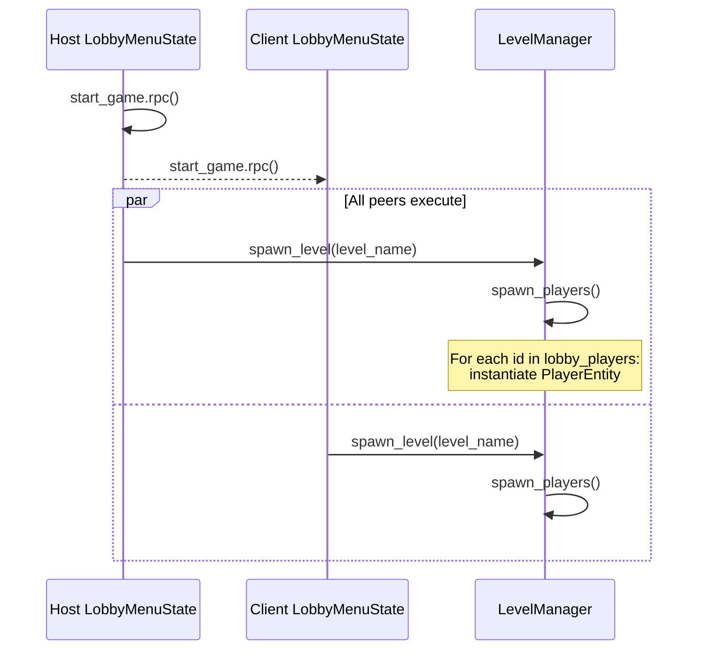
```mermaid
sequenceDiagram
    participant HostLobby as Host LobbyMenuState
    participant ClientLobby as Client LobbyMenuState
    participant LM as LevelManager

    HostLobby->>HostLobby: start_game.rpc()
    HostLobby-->>ClientLobby: start_game.rpc()

    par All peers execute
        HostLobby->>LM: spawn_level(level_name)
        LM->>LM: spawn_players()
        Note over LM: For each id in lobby_players:<br/>instantiate PlayerEntity
    and
        ClientLobby->>LM: spawn_level(level_name)
        LM->>LM: spawn_players()
    end
```

**Result**: All peers load the same level with all players spawned.

---

## Deep Dive: Connection Signals

The system has multiple connection signals. Here's why each exists:

### Signal Timeline

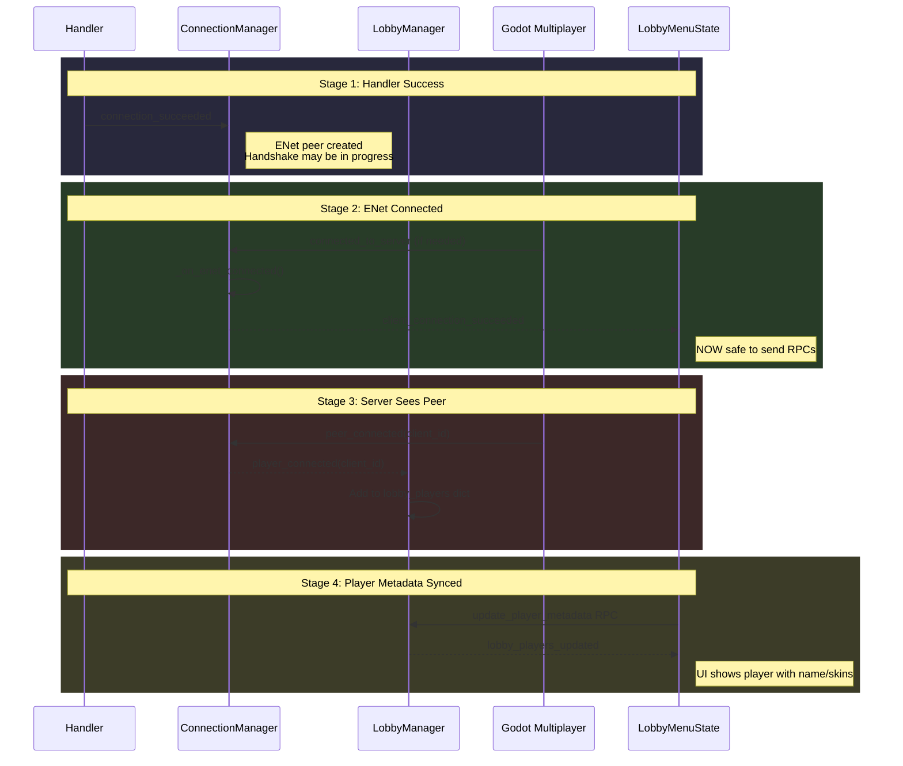
```mermaid
sequenceDiagram
    participant Handler as Handler
    participant CM as ConnectionManager
    participant LM as LobbyManager
    participant Godot as Godot Multiplayer
    participant Lobby as LobbyMenuState

    rect rgb(40, 40, 60)
        Note over Handler,Lobby: Stage 1: Handler Success
        Handler->>CM: connection_succeeded
        Note right of CM: ENet peer created<br/>Handshake may be in progress
    end

    rect rgb(40, 60, 40)
        Note over Handler,Lobby: Stage 2: ENet Connected
        Godot->>CM: connected_to_server (if needed)
        CM->>CM: _on_enet_connected()
        CM-->>Lobby: client_connection_succeeded
        Note right of Lobby: NOW safe to send RPCs
    end

    rect rgb(60, 40, 40)
        Note over Handler,Lobby: Stage 3: Server Sees Peer
        Godot->>CM: peer_connected(client_id)
        CM-->>LM: player_connected(client_id)
        LM->>LM: Add to lobby_players dict
    end

    rect rgb(60, 60, 40)
        Note over Handler,Lobby: Stage 4: Player Metadata Synced
        Lobby->>LM: update_player_metadata RPC
        LM-->>Lobby: lobby_players_updated
        Note right of Lobby: UI shows player with name/skins
    end
```

### Signal Reference

| Signal                        | Source              | When                 | Purpose               |
| ----------------------------- | ------------------- | -------------------- | --------------------- |
| `connection_succeeded`        | Handler             | ENet peer created    | Low-level success     |
| `client_connection_succeeded` | ConnectionManager   | ENet fully connected | **Safe for RPCs**     |
| `player_connected(id)`        | ConnectionManager   | Server sees peer     | LobbyManager listens  |
| `game_id_set(addr)`           | ConnectionManager   | Got OID/IP           | Display invite code   |
| `lobby_players_updated`       | LobbyManager        | After sync RPC       | Update player list UI |
| `connection_reset`            | ConnectionManager   | Server/client stops  | LobbyManager clears   |

### Why Two Stages?

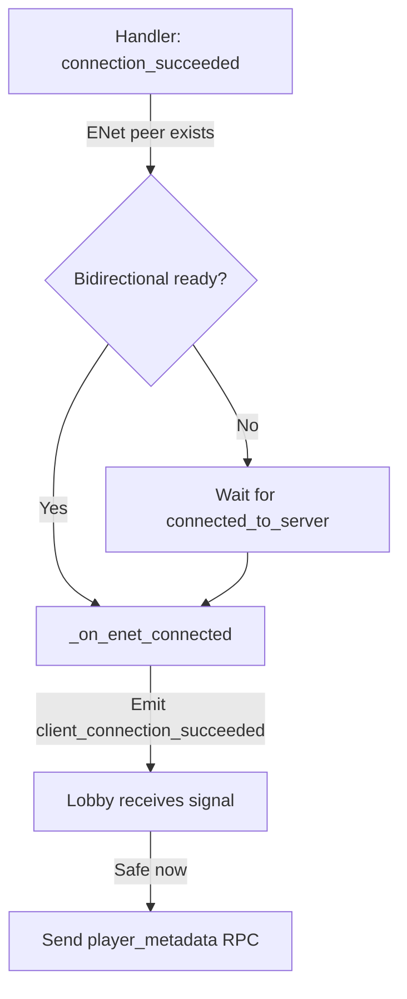
```mermaid
flowchart TD
    A[Handler: connection_succeeded] -->|"ENet peer exists"| B{Bidirectional ready?}
    B -->|No| C[Wait for connected_to_server]
    B -->|Yes| D[_on_enet_connected]
    C --> D
    D -->|"Emit client_connection_succeeded"| E[Lobby receives signal]
    E -->|"Safe now"| F[Send player_metadata RPC]
```

Edge cases handled:

1. Handler succeeds but ENet handshake fails
2. ENet connects but server doesn't acknowledge
3. Client tries RPC before channel ready

The ENet ready check is handled inside `ConnectionManager._on_handler_connection_succeeded()`, so `client_connection_succeeded` only fires once the peer is fully connected and RPCs are safe to send.

Code pattern in `connection_manager.gd`:

```gdscript
func _on_handler_connection_succeeded(peer_id: int):
    if multiplayer.multiplayer_peer.get_connection_status() != MultiplayerPeer.CONNECTION_CONNECTED:
        multiplayer.connected_to_server.connect(_on_enet_connected.bind(peer_id), CONNECT_ONE_SHOT)
    else:
        _on_enet_connected(peer_id)

func _on_enet_connected(peer_id: int):
    client_connection_succeeded.emit(peer_id)
```

---

## Deep Dive: Player Metadata RPC Flow

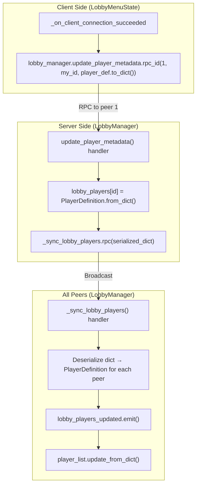
```mermaid
flowchart TB
    subgraph Client["Client Side (LobbyMenuState)"]
        C1[_on_client_connection_succeeded]
        C2["lobby_manager.update_player_metadata.rpc_id(1, my_id, player_def.to_dict())"]
        C1 --> C2
    end

    subgraph Server["Server Side (LobbyManager)"]
        S1["update_player_metadata() handler"]
        S2["lobby_players[id] = PlayerDefinition.from_dict()"]
        S3["_sync_lobby_players.rpc(serialized_dict)"]
        S1 --> S2 --> S3
    end

    subgraph All["All Peers (LobbyManager)"]
        A1["_sync_lobby_players() handler"]
        A2["Deserialize dict → PlayerDefinition for each peer"]
        A3["lobby_players_updated.emit()"]
        A4["player_list.update_from_dict()"]
        A1 --> A2 --> A3 --> A4
    end

    C2 -->|"RPC to peer 1"| S1
    S3 -->|"Broadcast"| A1
```

### RPC Signatures

```gdscript
# In LobbyManager (lobby_manager.gd)

# Client → Server (sends full PlayerDefinition as dict)
@rpc("any_peer", "call_local", "reliable")
func update_player_metadata(peer_id: int, player_def_dict: Dictionary):
    if !multiplayer.is_server(): return
    var player_def = PlayerDefinition.new()
    player_def.from_dict(player_def_dict)
    lobby_players[peer_id] = player_def
    _sync_lobby_players.rpc(_lobby_players_to_dict())

# Server → All (broadcasts serialized lobby_players)
@rpc("call_local", "reliable")
func _sync_lobby_players(players_dict: Dictionary):
    lobby_players.clear()
    for peer_id_str in players_dict:
        var peer_id = int(peer_id_str)
        var player_def = PlayerDefinition.new()
        player_def.from_dict(players_dict[peer_id_str])
        lobby_players[peer_id] = player_def
    lobby_players_updated.emit(lobby_players)
```

**Why this pattern?**

- Server is authoritative (single source of truth)
- `PlayerDefinition` contains username, skins, and future metadata (money, xp)
- Single RPC replaces separate username + skin RPCs
- Full dict sync prevents delta bugs
- `call_local` ensures server updates its own UI
- `reliable` ensures critical data arrives

---

## Deep Dive: Level Selection Sync

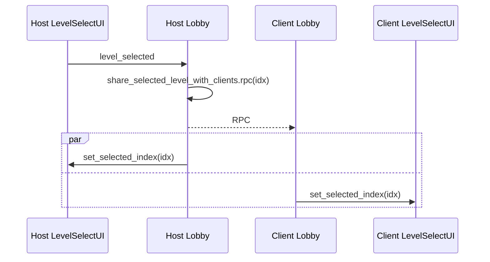
```mermaid
sequenceDiagram
    participant HostUI as Host LevelSelectUI
    participant HostLobby as Host Lobby
    participant ClientLobby as Client Lobby
    participant ClientUI as Client LevelSelectUI

    HostUI->>HostLobby: level_selected
    HostLobby->>HostLobby: share_selected_level_with_clients.rpc(idx)
    HostLobby-->>ClientLobby: RPC

    par
        HostLobby->>HostUI: set_selected_index(idx)
    and
        ClientLobby->>ClientUI: set_selected_index(idx)
    end
```

Clients see the same level selected, but only host can change it.

---

## Deep Dive: Player Spawning

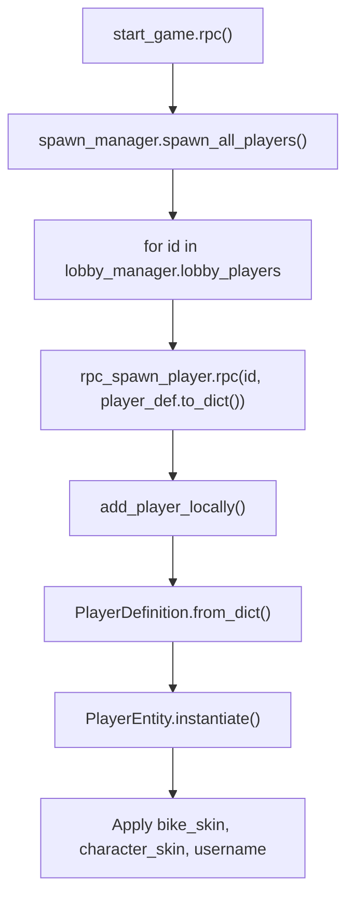
```mermaid
flowchart TB
    A["start_game.rpc()"] --> B["spawn_manager.spawn_all_players()"]
    B --> C["for id in lobby_manager.lobby_players"]
    C --> D["rpc_spawn_player.rpc(id, player_def.to_dict())"]
    D --> E["add_player_locally()"]
    E --> F["PlayerDefinition.from_dict()"]
    F --> G["PlayerEntity.instantiate()"]
    G --> H["Apply bike_skin, character_skin, username"]
```

```gdscript
# SpawnManager broadcasts spawn to all peers
func spawn_all_players():
    for peer_id in lobby_manager.lobby_players:
        var player_def: PlayerDefinition = lobby_manager.lobby_players[peer_id]
        rpc_spawn_player.rpc(peer_id, player_def.to_dict())

# SpawnManager creates player locally
func add_player_locally(peer_id: int, player_def_dict: Dictionary):
    var player_def = PlayerDefinition.new()
    player_def.from_dict(player_def_dict)

    var player_to_add = level_manager.current_level.player_entity_scene.instantiate()
    player_to_add.name = str(peer_id)  # Critical for netfox sync
    player_to_add.bike_definition = player_def.bike_skin
    player_to_add.character_definition = player_def.character_skin
    level_manager.current_level.player_spawn_pos.add_child(player_to_add, true)
    player_to_add.username = player_def.username
```

**Key detail**: Node name = peer ID, which netfox uses for rollback sync.

---

## State Machine Overview

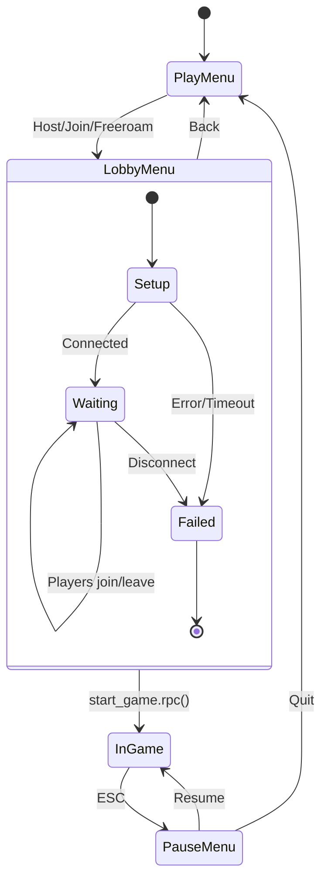
```mermaid
stateDiagram-v2
    [*] --> PlayMenu

    PlayMenu --> LobbyMenu: Host/Join/Freeroam

    state LobbyMenu {
        [*] --> Setup
        Setup --> Waiting: Connected
        Waiting --> Waiting: Players join/leave
        Setup --> Failed: Error/Timeout
        Waiting --> Failed: Disconnect
        Failed --> [*]
    }

    LobbyMenu --> InGame: start_game.rpc()
    LobbyMenu --> PlayMenu: Back

    InGame --> PauseMenu: ESC
    PauseMenu --> InGame: Resume
    PauseMenu --> PlayMenu: Quit
```

---

## Error Handling

### Connection Timeout

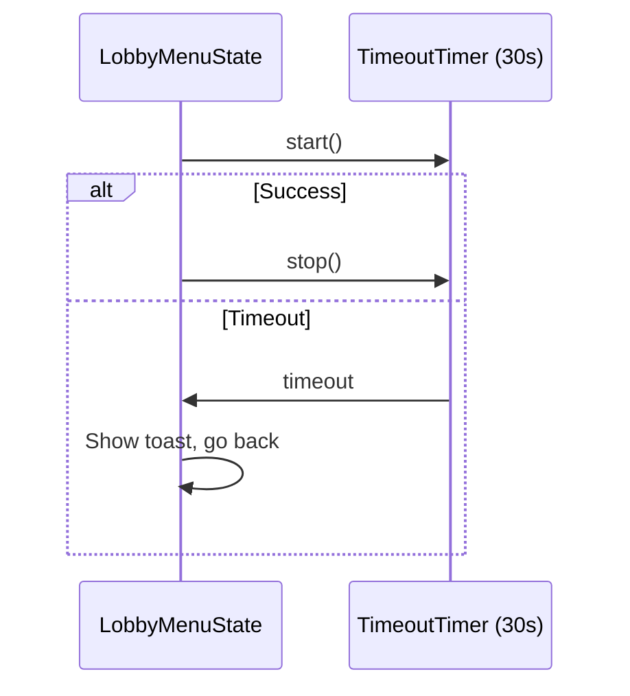
```mermaid
sequenceDiagram
    participant Lobby as LobbyMenuState
    participant Timer as TimeoutTimer (30s)

    Lobby->>Timer: start()
    alt Success
        Lobby->>Timer: stop()
    else Timeout
        Timer->>Lobby: timeout
        Lobby->>Lobby: Show toast, go back
    end
```

### Server Disconnect

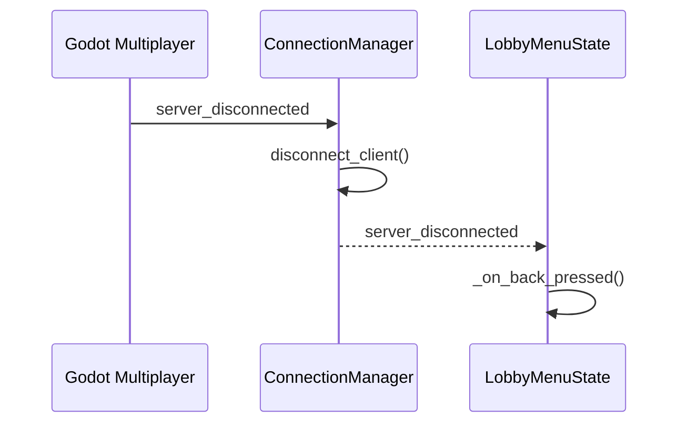
```mermaid
sequenceDiagram
    participant Godot as Godot Multiplayer
    participant CM as ConnectionManager
    participant Lobby as LobbyMenuState

    Godot->>CM: server_disconnected
    CM->>CM: disconnect_client()
    CM-->>Lobby: server_disconnected
    Lobby->>Lobby: _on_back_pressed()
```

---

## Connection Mode Detection

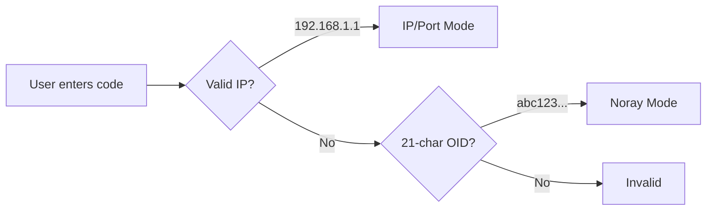
```mermaid
flowchart LR
    Input[User enters code] --> Check{Valid IP?}
    Check -->|"192.168.1.1"| IP[IP/Port Mode]
    Check -->|No| Check2{21-char OID?}
    Check2 -->|"abc123..."| Noray[Noray Mode]
    Check2 -->|No| Invalid[Invalid]
```

```gdscript
func _auto_detect_connection_mode(text: String):
    if text.is_valid_ip_address():
        connection_manager.connection_mode = ConnectionManager.ConnectionMode.IP_PORT
    elif _is_valid_noray_oid(text):
        connection_manager.connection_mode = ConnectionManager.ConnectionMode.NORAY
```

---

## Key Code Locations

| Component              | File                   | Description                              |
| ---------------------- | ---------------------- | ---------------------------------------- |
| PlayerDefinition       | player_definition.gd   | Resource with username, skins, to_dict() |
| SaveManager            | save_manager.gd        | Persists local PlayerDefinition          |
| Server startup         | connection_manager.gd  | start_server(), connect_client()         |
| Connection handling    | connection_manager.gd  | _on_handler_connection_succeeded()       |
| Lobby players dict     | lobby_manager.gd       | lobby_players, update_player_metadata(), _sync_lobby_players() |
| Game start RPC         | gamemode_manager.gd    | start_game(), late-joiner sync           |
| Player spawning        | spawn_manager.gd       | spawn_all_players(), rpc_spawn_player(), add_player_locally() |
| Player list UI         | player_list_ui.gd      | update_from_dict() with PlayerDefinition |
