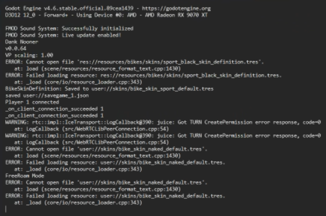

# Scratch Pad
---


CRASH

seb's skin doesn't exist on joses PC

LOG
```
ERROR: Cannot open file 'user://skins/bike_skin_sport_default.tres'.
   at: load (scene/resources/resource_format_text.cpp:1430)
ERROR: Failed loading resource: user://skins/bike_skin_sport_default.tres.
   at: _load (core/io/resource_loader.cpp:343)
```

```
Godot Engine v4.6.stable.official.89cea1439 - https://godotengine.org
D3D12 12_0 - Forward+ - Using Device #0: NVIDIA - NVIDIA GeForce RTX 5080

FMOD Sound System: Successfully initialized
FMOD Sound System: Live update enabled!
Dank Nooner
v0.0.64
VP scaling: 1.00
Player 1 connected
_on_client_connection_succeeded 1
_on_client_connection_succeeded 1
WARNING: rtc::impl::IceTransport::LogCallback@390: juice: Send failed, errno=10051
   at: LogCallback (src/WebRTCLibPeerConnection.cpp:54)
WARNING: rtc::impl::IceTransport::LogCallback@390: juice: STUN message send failed
   at: LogCallback (src/WebRTCLibPeerConnection.cpp:54)
WARNING: rtc::impl::IceTransport::LogCallback@390: juice: Got TURN CreatePermission error response, code=0
   at: LogCallback (src/WebRTCLibPeerConnection.cpp:54)
WARNING: rtc::impl::IceTransport::LogCallback@390: juice: Got TURN CreatePermission error response, code=0
   at: LogCallback (src/WebRTCLibPeerConnection.cpp:54)
Player 1408156474 connected
_on_client_connection_succeeded 1408156474
WARNING: rtc::impl::IceTransport::LogCallback@390: juice: Got TURN CreatePermission error response, code=0
   at: LogCallback (src/WebRTCLibPeerConnection.cpp:54)
WARNING: rtc::impl::IceTransport::LogCallback@390: juice: Got TURN CreatePermission error response, code=0
   at: LogCallback (src/WebRTCLibPeerConnection.cpp:54)

```

