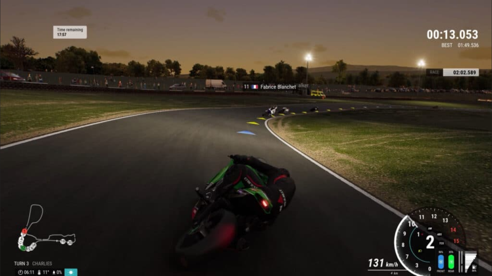

# TODO

> Don't forget, have fun :D

## In Progress 🚀
- [ ] Use Curves to create roads
  - [ ] In godot or blender?
- [ ] tutorial finished MP => clients dont respawn back in free roam
- [WIP] Gamemode select on map select
  - [ ] crashing during tutorial doesn't stop timers
  - [ ] e.g. tutorial 01 plays that gamemode on a specific map, update the leveldefinitions to support this
  - [x] Update tutorial mode to choose tutorial steps
- [ ] Tutorials should be single playerish, but server should still know. only RPC to that peer though.
- [ ] Close tutorial hud when leaving game
- [ ] tutorial press RT/B should be dependent on controlscheme, and be shown in more steps
- [ ] tutorial gamemode - _ctx doesnt make sense
> Take it slow, fix bugs and add polish to player controller
- [ ] GamemodeEvent System & First tutorial
  - [x] vibe code tutorial / connect systems from [GamemodeSystem.md](./GamemodeSystem.md)
  - [ ] Review tutorial code
  - [ ] Review gamemode transition code when entering circle to starting tutorial mode
  - [ ] Single/multiplayer support

- [ ] New menu type
  - [ ] Create loading inbetween screen
  - [ ] Create win/lose inbetween screen

## Up Next (Finish POC MP Gameplay Demo) 📋

- [ ] Option to change localization language

- [ ] Pause => show lobby

> POC = playable gamemodes w/ friends, see if core gameplay loop works
> video record this once playing with everyone, save log files

- [ ] Basic core gameplay loop / implement gamemodes

  - [ ] Review gamemode controller + signals emitted for spawning/crashing/trick scoring
  - [ ] start gamemodes via map select
  - [ ] Game modes:
    - [ ] Free roam
      - [ ] Get Score saved to disk for tricks
    - [ ] Street race
      - [ ] w/ and w/o traffic
      - [ ] Podium scene after race ends
      - [ ] Get Score saved to disk w/ bonus for podium
    - [ ] Stunt race
      - [ ] Mario kart like - get items to attack players or help self, but do tricks to get items. More complex tricks = better items
    - [ ] Ragdoll launch game mode
      - [ ] Like hall of meat
  - [ ] Unlock Skins w/ Score from disk & spend

- [ ] 2 difficulties, arcade & sim. Sim grants 1.5x score
  - [ ] arcade still has gear changes, no clutch except to start wheelie
- [ ] Be able to reverse (play animation)
  - [ ] Hold clutch, brake to reverse
- [ ] Trick Manager + tricks

  - [ ] Move wheelie logic from movement controller
  - [ ] trick system
    - [ ] migrate wheelie / stoppie tricks
    - [ ] ramp tricks
    - [ ] ground tricks
  - [x] trick detection in trick_controller
  - [ ] trick scoring in separate script
    - [ ] e.g. player emits trick_done & gamemode manager does something with it.
      - [ ] e.g. race/freeroam => boost
      - [ ] e.g. stunt race => combo counter
  - [ ] Create wheelie + DOWN animation (wheelie + right hand touches ground)
  - [ ] Create Heel clicker / other trick animations
  - [ ] Land into wheelie / stoppie should be a trick

- [ ] Improve CrashController

  - [ ] Brake danger
  - [x] Layer 2 collision (with objects & players)
  - [ ] Sync w/ players
    - [ ] crashing into player => both should be affected
  - [ ] Swap to rigidbody, make bounding box of mesh & apply velocity to bike & collision
  - [ ] Emit signals to gamemode controller

- [ ] Review Animation Controller & Create animations

  - [ ] AnimationController + Trick integration
    - [ ] debug wheelie animation
    - [ ] debug naked bike init ik / load default animation not working
  - [ ] AnimationController + Crash integration
    - [ ] Create crash animation (procedural)
  - [ ] Create lean (turning) animation
  - [ ] Create stopped/idle animation
  - [x] Create wheelie/stoppie animation
  - [x] Add pull/lean back animation when starting a wheelie
  - [ ] backflip landing is snappy, and always lands in wheelie/stoppie
  - [ ] wheelie turning animation should be different, should yaw
  - [x] claude created a system
  - [x] Review planning_docs/AnimationController.md
  - [x] Create way to play specific animations

- [ ] Basic Traffic AI

  - [ ] Collisions w/ bikers (causes a crash)
  - [ ] Navigates in Loops, dumb AI
    - [ ] Maybe along path?
    - [ ] Maybe use AnimationPlayer?
  - [ ] Near-Miss trick
    - [ ] riding close by without touching = points
    - [ ] Doing a wheelie & riding close will do a new trick
    - [ ] anim: touch hand against car like trick tweak

- [ ] Create Save System for in-game

  - [x] Save bike definitions on disk
  - [ ] save unlocked tricks, mods, etc.
  - [x] Save levels / player stuff

- [ ] Basic customization menu / UI

  - [ ] Subview port to make icons - for bike skin selection
  - [x] Super basic customize ui
  - [x] Save chosen skin to disk
    - [x] path to skin_def for now, no custom json yet
    - [x] player_entity
      - [x] save_skin
      - [x] load_skin
    - [x] when spawning player in game, show their customizations via load_skin
  - [ ] Create customize menu background scene
    - [ ] Garage scene
    - [ ] show character
    - [ ] show bike
  - [ ] Create customize menu UI
    - [ ] Tab for shop
      - [ ] List purchasable skins
      - [ ] Purchase bike skins
      - [ ] Purchase character skins
    - [ ] Tab for "my stuff"
      - [ ] List purchasedskins
      - [ ] Choose a bike skin
      - [ ] Choose a character skin

- [ ] Review webrtc gen code for security
- [ ] Competitive modes
- [ ] More audio

  - [ ] Soundscapes for ambient sounds, get diff clips and play them in different orders, at random times to set mood & add sound variety
  - [ ] add clunk sound when changing gears
  - [ ] Crash SFX
  - [ ] Tire Screetch SFX
  - [ ] Menu click sounds
  - [ ] Music?
  - [ ] [Web](https://github.com/utopia-rise/fmod-gdextension/pull/210#issuecomment-3717948490)

## Backlog

- [ ] Android setup keystore & add to github secrets & enable in build.yml

- [ ] https://docs.discord.com/developers/resources/invite
- [ ] Slow down time when launching off ramps to do tricks - client side somehow?

- [ ] Friends + invites + server browser
- [ ] Gamemode / Score / XP / $ v2

  - [ ] Collect via challenges in gamemodes
    - [ ] Freeroam:
      - [ ] Collect items
      - [ ] Lobby Leaderboard Challenges (longest wheelie on server, biggest crash, etc.)
      - [ ] Weekly Challenges (5x crashes, hold wheelie for 20s, etc.)
    - [ ] Race:
      - [ ] Podium finish
      - [ ] Lobby Leaderboard Challenges (fastest lap time, top speed, most crashes)
      - [ ] Weekly Challenges (wheelie during a race, boost 5 times, etc.)
  - [ ] Spend
    - [ ] Unlock tricks
    - [ ] Unlock cosmetics
    - [ ] Unlock performance mods

- [ ] Audio Manager v2

  - [ ] Use fmod to blend sounds @ rpm
  - [ ] Record my bike for sounds
    - [ ] Wind sounds at high speed
    - [x] startup
    - [x] idle
    - [ ] holding rev at diff rpm, switch files in game
    - [ ] full rev
    - [ ] exhaust pops
    - [ ] downshift/rev match
    - [ ] shifting gears
  - [x] Make audio buses
    - [x] 2d - SFX (ui sounds, timers, etc.)
    - [x] 3d - SFX (RPM / bike)
    - [x] 2d - Music
  - [ ] Different bikes use different audio samples

- [ ] Multiplayer improvements
  - [ ] return to lobby (force everyone)
  - [ ] review all code & cleanup to call authority done
  - [ ] update Architecture.md
  - [x] saving settings doesnt update noray host
- [ ] software is open source, but assets aren't public
- [ ] Pizza Delivery game mode

  - [ ] start at Pizza shop & use scooter to make deliveries across town in time.
  - [ ] Multiplayer too, they have different houses to go to
    - [ ] Or compete to get there first

- [ ] map

  - [ ] Outline of island is the shape of an F1 track, and is drivable. The inside is the island map itself
    - [ ] Brazil track
    - [ ] Moom map? Low gravity
    - [ ] 3D printer map => level is 3d printed in real time
    - [ ] start with graybox/repeating grid texture to plan out maps before are is decided , use multiple colors & labels

- [ ] More Customization UI / menu

  - [ ] Add Bike customization
    - [ ] **BikeDefinition** with component definitions under it since I will have multiple bike types, colors, and mods for each type.
      - [ ] character accessories (cosmetics, etc.)
        - [ ] helmet
        - [ ] backpack
      - [ ] bike mods (color, actual mods) (**basic customization**)
      - [ ] base mesh **MeshDefinition**
      - [ ] color override
      - [ ] BikeMod list
        - [ ] **ModDefinition**
          - [ ] **MeshDefinition**
          - [ ] **Marker3D**
          - [ ] script
  - [ ] Add Character customization (choose character for now)
  - [ ] Change color w/ color picker

- [ ] Vibe code a painterly shader I can add as an extra pass. Add brush stroke lines

- [ ] Tutorial level 1
  - [ ] Explain how to progressively brake
  - [ ] Go this fast & brake, don't squeeze hard asap, slowly squeeze.
  - [ ] Force them to try again til they get it
- [ ] Create Test Level - Gym - player controller, with tp. Basically in game documentation. (E.g. How far can you jump)

  - [] Make the world fit around the player controller.
  - [ ] [ramp physics](https://www.reddit.com/r/godot/s/O6aKthtk9i)

- [ ] Create Test Level - Zoo - all relevant models/scenes in 3d space to easily compare

  - (E.g. diff bikes/mods on each bike)
  - There's a godot plugin for this
  - https://binbun3d.itch.io/godot-ultimate-toon-shader

- [ ] Camera control
- [ ] Dedicated server

  - [ ] Lobby is created, then sends it's IP to a matchmaking server (http)
  - [ ] When creating lobby, add invite only mode or open lobby
  - [ ] Server browser can list all servers that register
  - [ ] Add game mode for open lobby (for server to reset to with 0 players) or just go to free roam?
  - [ ] Quick join lobby

- [ ] Create complex traffic / AI system

  - [ ] basic traffic sim
  - [ ] implement A\* pathfinding? w/ state machine?
    - [ ] drive, stopped at light, parked, etc.
  - [ ] create sequence system?

- [ ] Create Test Level - Museum - functionally show how systems work, text explaining the systems.
  - (E.g. showing physics demos, how scripted sequences work)
- [ ] Create Island Level

  - [ ] render trees/etc. with multi mesh

## Polish / Bugs

- [ ] find hook for dank nooner, what makes it cool!

- [ ] broken back button via: play => lobby => back => customize => back

- [ ] back from lobby => customize goes to play menu instead of lobby menu

- [ ] Free play => back => host game broken, creates dupe multiplayer init

- [ ] add to MenuState validation, somehow.

  - "Be sure to set return_state on Enter()!"

- [ ] Resizing window should save in settings => windowed/maximized

  - i.e. change camera should not resize window if i maximized it after setting to windowed

- [ ] Camera zoom out cam FOV w/ speed / current_trick != None

- [ ] Update settings via controller
- [ ] Add loading UI

  - [ ] Show when swtiching levels

- [ ] reactive sounds (play when player does something) = juice
- [ ] Add transition animations (e.g. circle in/out) between Menu States / Loading states
- [ ] Add text chat

## Done ✅

- [x] speed it capped at 30 in 1st gear, but RPM keeps climbing these should happen at the same time

- [x] Lean back/fwd animation

- [x] Crash on the back of ramps

- [x] reduce brake amount

- [x] when crashing upside down, the wheelie balance bar shows up on respawn

- [x] Mouse cursor showing/hiding in gamemode event should be handled in gamemodeeventconfirmhud via rpc insetad of in freeroamgamemode
  - [x] start circle hud, leaving doesn't reset mouse back to original captured state

- [x] Bug: Crash respawn when client messes up rotation/animation

- [x] uncheck ip/port btn when going from free roam to play menu

- [x] Add colors to redline RPM

- [x] gamemode select hud shows on all clients
  - [x] basic

- [x] trick started keeps emitting/printing during the trick, should only happen once...

- [x] mobile, move LB to left..

- [ ] Move respawn logic to gamemode controller, using new signals

- [x] Improved (non-text) HUD

  - [x] add rpm guage from pics
  - [x] Overlay layer for tutorial
  - Ideas:
    - In-world UI
    - Bottom right has guages like IRL bike (analog)
    - Center has guages like TFT (digital)
    - Grip / danger:
      - Bottom, wide red line
      - Red overlay like COD dmg
      - Guages have red overlay & change size
    - Mini Map? or Compass w/ arrow

- [x] touchscreen controls for mobile

- [x] Redo movement_controller

  - [x] Improve RPM Blending
  - [x] Launching off ramp kills speed
  - [x] player can fly if leaning when launching off loop
  - [x] Stop Wheelie-ing by riding then tapping clutch once will hold it perfectly
  - [x] Super laggy when riding w/ friends
    - [x] Rubber banding is crazy here
  - [x] WASD support

- [x] disable current option when using help / controls menu, change type to radio/toggle

- [x] Basic show controls UI

- [x] on clients:

  - [ ] When crashing into something during a wheelie, you respawn broken.
    - [ ] in half wheelie anim, without body
    - [ ] "Crashed...respawning" in HUD
  - [x] cant change gears after going from 1=>2

- [x] web mobile seems to crash? Spawn in with no controls hud or body

- [x] don't copy IP to clipboard if free play

- [x] can't crash upside down anymore, look at backflip code in crash_controller

- [x] Reduce air drag, test on mega ramp

- [x] Touch controls don't work

  - [x] Should work on web on phone
  - [x] Maybe build apk too

- [x] Stoppie balance bar broken

- [x] Balance point showed like grinding balance in tony hawks pro skater in HUD

- [x] Make loopdeloop larger

- [x] more wheelie angle overall

- [x] adjust pitch mid air

- [x] movement_controller updates

  - [x] finish cleanup (function split)
  - [x] basic wheelies / stoppies
  - [x] improve physics
  - [x] be able to ride up ramps
    - [x] (maybe raycast to rotate to normal?) one for each wheel?
    - [x] Use speed/momentup to stay on ramps (e.g. loop)
    - [x] handle gravity manually.
    - [x] Slow down as you go up in angle
  - [x] Launch off ramps to catch "hang time" (adjust gravity)
  - [x] loop de loop code

- [x] WebRTC doesn't ALWAYS work?

  - [x] Lobby code works, but TURN/STUN doesn't
  - [x] Check connection outside of home wifi

- [x] Camera improvements

  - [x] Fix camera follows wrong person!
  - [x] Pausing loses mouse for rotating camera
  - [x] rotate w/ mouse/joystick
  - [x] settings for sensitivity/invert/tps|fps mode
  - [ ] Camera should not rotate with player (e.g. loops, ramps)

- [x] Add HUD for player

  - 
  - See [tps-hud.excalidraw](./diagrams/tps-hud.excalidraw)
  - [x] Basic text only HUD
  - Reqd:
    - [x] Throttle
    - [x] Speed
    - [x] Brake
    - [x] Clutch
    - [x] Gear
    - [x] Grip (danger)
    - [x] Place for trick messages
    - [x] Place for gamemode messages (place, lap time, etc.)
    - [x] Place for challenges panel

- [x] signal relay host setting update doesn't save ? Double check!

- [x] Create Player Part 2

  - [x] ~~**Delete** all imported stuff and start clean. Use old code as reference~~
  - [x] Refactor/cleanup
  - [x] Fix collision
  - [x] Decide what should be client side vs server side
  - [x] Make sure MP authority is set properly
  - [ ] New netcode changes / authority:

    - [x] InputController
    - [x] GearingController
    - [x] MovementController
      - [ ] Move pitch_angle/lean_angle out to player_entity since they're sync'd
    - [x] AnimationController

  - [x] Sync as little as possible
    - no input/movement/gear calculations
    - no sound for other players for now
    - sync animations (procedural position)
    - sync bike pos/rot
  - [x] Update [doc](./PlayerController.md)

- [x] Sync clutch inputs & gear changes w/ server

- [x] holding clutch while reving makes you move when it shouldn't

- [x] Mac build won't run

- [x] bikeskin have front & rear wheel markers for wheelie / stoppie offsets

- [x] web updates:

  - [x] rm quit button, replace with Press ESC x2 to quit
  - [x] don't go fullscreen in default settings

- [x] Web

  - [x] WebRTC (?)
  - [x] Quit on Web should just escape fullscreen

- [x] Deploy web to github.io

- [x] disconnect after some period of time

  - [x] Lobby closes?

- [x] customize skin from pause menu

  - [x] menu context
  - [x] actually update in game

- [x] fix webrtc WAN not connecting => it was dns

- [x] noray => WebRTC

  - Use webrtc for nat punch thru with stun/turn server
  - Coturn docker to host
    - https://github.com/coturn/coturn/blob/master/docker/coturn/README.md
  - Signaling / matchmaking server in go? or is this possible in godot?
  - https://github.com/godotengine/godot-demo-projects/tree/master/networking/webrtc_signaling
    - server/
    - client/
  - https://github.com/jonandrewdavis/andoodev-godot-web-rtc-p2p
    - full demo, but not using std tools
  - https://www.reddit.com/r/gamedev/comments/1872muu/nat_traversal_solutions_for_multiplayer_in_godot/

- [x] cleanup lobby / joining w/ player definition

- [x] Create PlayerDefinition & Save system

  - [x] save selected skins
  - [x] save username
  - [x] save money

- [x] move spawn to spawn manager from level manager

- [x] Make SettingsMenu work with pause menu (compose this somehow)

- [x] level select img

  - [x] Load folder's images in menu
  - [x] Add doc

- [x] Create basic SettingsMenu scene/ui

  - [x] Create scene
  - [x] Improve the UI
  - [x] Add all components
  - [x] Functional settings

- [x] make working volume settings

- [x] fix github actions ci

- [x] customization resources aren't found at export/build time

- [x] Audio Manager

  - [x] fmod bike sounds
    - [x] Seamless loop w/ RPM

- [x] bugs

  - [x] Add version # + version check in game
  - [x] set max char limit for name
  - [x] First launch noray setting is not working, can't host properly. 2nd launch it works
    - [x] implement
    - [ ] TEST

- [x] saving not loading into selected item in ui

- [x] window settings, not updating ui when saving

- [x] Basic test map

  - zylann/godot_heightmap_plugin
  - [ ] big enough for game modes w/ friends
  - [ ] Option to enable/disable traffic
  - [ ] test_street_race_01
  - [ ] test_freeroam_01

- [x] Create Player Part 3

  - [x] place characterskin on the bike
  - [x] create bikeskin the same way characterskin works
  - [x] IK animations https://youtu.be/MbaPDWfbNLo?si=p5ybcrLUJje_nBgd

- [x] Bike definition

  - [x] bike model
  - [x] color
  - [x] markers (hand, pegs, seat/butt pos , mods)
  - [x] actually use the skins in player entity
  - [x] fix player entity

- [x] Splash screen / animation

  - [x] Add as the splash_loading_menu
  - [x] Option to press any btn to skip

- [x] singleplayer doesn't spawn

- [x] CharacterSkin / mesh

  - [x] move butt w/ marker

  - [x] Find a good way to import meshes with rigs
  - [x] Import animations in a uniform way
  - [x] document
  - [x] change material (colors)
  - [x] use resources to control
  - [x] add marker3d in resource to place accessories
  - [x] add ragdoll
  - [x] add IK
    - [x] generation process
    - [x] arms
    - [x] legs
    - [x] head/look at
  - [x] add basic test animation

- [x] multiplayer / spawn mgr cleanup

  - [x] close server when going to main menu
  - [x] join game during play
    - [x] WIP - **MUST REVIEW THE CODE MYSELF**

- [x] Create GamemodeManager

  - [x] create system
  - [x] Move spawning logic from level manager to gamemode manager
    - [x] Make test level default free roam mode

- [x] username in lobby

- [x] Create settings save system

  - [x] Save custom username for lobbies
  - [x] add noray relay host in config file for game
  - [x] window settings (fullscreen or not)

- [x] on spawn, make players virtually press c

  - [ ] by default they're looking at the hosts camera

- [x] respawn in pause menu

- [x] when host ALT+F4's run server_disconnect.

- [x] Noray / lobby improvements
  - [x] noray bug on client connect sometimes: Invalid access of index '1' on a base object of type: 'PackedStringArray'.
    - [x] maybe when game id is wrong?
  - [x] auto detect game join code or ip address
  - [x] toggle between port/ip & noray mode
  - [x] noray timeout
  - [x] client doesnt see invite code/ip
  - [x] dont allow players to select menu levels
  - [x] copy game id when hosting right away
  - [x] leave game = reset network settings to default
- [x] on server disconnect, reload bg-menu-level for clients

- [x] deploy noray server

- [x] Add nat punch (netfox.noray) to make lobbies

- [x] singleplayer mode logic (just host! & be a server)

- [x] camera switching
- [x] Make server authoritative
  > cleanup player_entity so only local cams are used, etc.
  - [x] Change `PlayerEntity._enter_tree()` to `set_multiplayer_authority(1)` (server owns all)
  - [x] Add `receive_input()` RPC to `InputController`
  - [x] In `InputController._process()`: if local, send input to server via `receive_input.rpc_id(1, ...)`
  - [x] Store received input per-player on server (Dictionary keyed by peer ID)
  - [x] Move `MovementController._physics_process()` to only run on server
  - [x] `MovementController` reads input from server's input buffer instead of local `InputController`
  - [x] Add `MultiplayerSynchronizer` to `PlayerEntity` for position/rotation
  - [x] (Later) Integrate netfox for client prediction + rollback reconciliation
- [x] Create NetworkManager
  - [x] Create lobby
    - [x] players can join / be seen
  - [x] plan MP authority
    - [x] only host can start game
    - [x] host chooses level, others can see
  - [x] Create SpawnManager & sync players
  - [x] set username
- [x] Connect \_on_peer_connected to add_player_to_lobby
- [x] Create Player Part 1
  - > no animations for now
  - [x] Player scene + component scripts
    - [x] movement
  - [x] basic bike selection (select bike)
  - [x] InputManager in game
    - [x] bike control
- [x] 21x9 support
- [x] format on save
- [x] Move planning docs to v2 folder (also update README.md)
- [x] mouse capture broken
- [x] Git LFS
- [x] Create basic PauseMenu scene/ui
  - [x] Create scene/script
  - [x] Option to go back to main menu
  - [x] Pause / resume functionality
- [x] Create InputManager
  - [x] Mouse / Gamepad switching
  - [x] Gamepad to control Menus
  - [x] Show/Hide the cursor
- [x] Connect signals between all managers in ManagerManager
- [x] Create LevelManager
  - [x] base class / states
  - [x] Move BGClear Rect as a level type
  - [x] create first 3d test level
  - [x] auto validation
  - [x] Make level select work
  - [x] Update Architecture.md
- [x] Add toast UI
- [x] Finish UI routing
  - [x] Pass params to states via context
  - [x] nav to lobby / level select depending on which button you choose
  - [x] connect all the buttons
- [x] Create basic LobbyMenu scene/ui
  - [x] Create scene
  - [x] Improve the UI
  - [x] Add all components
- [x] Create basic PlayMenu scene/ui
  - [x] Create scene / ui
  - [x] create all components (see excalidraw)
- [x] PrimaryBtn style
- [x] create menu uidiagram
- [x] Create UI Theme
- [x] Create basic MainMenu scene/ui
  - [x] Create scene
  - [x] Improve the UI
- [x] Fix Menu HACKS / Cleanup
  - [x] Update Architecture doc w/ final setup
- [x] Create MenuManager
- [x] Navigate between Menus
- [x] Basic Localization
- [x] Create ManagerManager
- [x] Create StateMachine
- [x] Update project plan
- [x] Create godot 4.6 project
- [x] Create folder structure
- [x] Create planning docs
